## CTF WEEK10

**Cifra inicial**

```
-[,)-[&;$/,$/>-;^|/_/,/,-:;,%-$;_-~+[_/;)~-,[],-;;,_-[;~/,(~;$?%;~/,_?^$[-[,-/^%~-$-+;~_-]$/;][*/[~-_-~=?/,^-(~/,[$/^:[-$;:;^,/]>;$/-$_[^[,%~-:-;$-:[,+/,%-(-~-)~/*/$/(;[,$;(/$[$;$/$/_[,,-;$/[$/^%[:;:-~@;;:?(-$;^--][-^:-,/@?~-$;~-^;-^;(-,,-$;--:%[*[$-$/$-:[,+:-~-:%/~[|;?,/+?^$-_/^%-]_/^%/(/]-(-~%[:[(-:-;^;,(~;:/,,;,$/-*-][-:-;^;-_)[%;$;(~;@~-_-$/(~[*-%[|-:;/,(/]-_;^%-@/_][$/~-^:-/[^%/@~-:-;$/,[^$[:-%;,+[^-^:/[~;,$/^?_/~;,-,;(/~-:;/,^;_/~:-$;$/:-([%-[,/(/]--,,/,,;~[-/,%~-%/@[:-/:;^,?]%;~[-^-,-~/-,{&/&~)/%(*,,||^@*}
```

- Inicialmente começamos por usar a mesma abordagem do logbook 9, ou seja analisar a frequência de simbolos individuais, duplos e triplos.

```shell
-------------------------------------
1-gram (top 20):
-: 80
/: 59
;: 51
,: 47
[: 41
$: 36
~: 34
^: 28
:: 27
%: 21
(: 18
_: 17
]: 12
?: 9
*: 7
@: 7
+: 6
): 5
|: 5
&: 3
-------------------------------------
2-gram (top 20):
$/: 17
/,: 14
~-: 13
:-: 12
-:: 11
-$: 10
;$: 9
$;: 9
[,: 8
-;: 7
;^: 7
,-: 7
;,: 7
-~: 7
-,: 7
_/: 6
,/: 6
:;: 6
;~: 6
[-: 6
-------------------------------------
3-gram (top 20):
;$/: 6
-$;: 6
/^%: 4
~-:: 4
-:-: 4
:-;: 4
-[,: 3
,$/: 3
-;^: 3
-:;: 3
~/,: 3
(~;: 3
%~-: 3
[$/: 3
$/^: 3
-;$: 3
-^:: 3
(/]: 3
/]-: 3
$/,: 2
```

- Depois disto, fomos procurar online, as letras com maior frequência na lingua portuguesa e também a palavra com 2 letras mais frequente, e conseguimos obter o "A" e o "DE" que trocámos pelos simbolos da cifra, com o seguinte comando:

```shell
tr '\-$/' 'ADE' <cipherctf.txt > out.txt
```

- Ao analisar o ficheiro out.txt, tentamos encontrar algumas palavras que nos fizessem sentido em português, e uma sequência pareceu nos muito a palavra "Pedido".

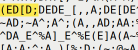

comando:

```shell
tr '\-$/([;' 'ADEPIO' <cipherctf.txt > out.txt
```

- Depois de percebermos que a troca fez realmente sentido no contexto do ficheiro, encontramos mais semelhanças, ao percebermos que o simbolo "," correspondia com quase toda a certeza à letra "S", fazia sentido pois com a troca ficavam palavras como "depois" e provavalemnte "demissão", e a "," era muito frequente tal como o "S" na lingua portuguesa.

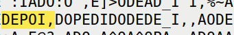

comando:

```shell
tr '\-$/([;,_' 'ADEPIOSM' <cipherctf.txt > out.txt
```

- Continuando a analisar o ficheiro out encontramos uma semelhança à palavra "assessoria",e que era corroborada pela frequência do simbolo "~" e da letra "R" na lingua portuguesa

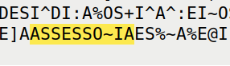

comando:

```shell
tr '\-$/([;,_~' 'ADEPIOSMR' <cipherctf.txt > out.txt
```

- Repetimos várias vezes esta análise e troca dos simbolos por letras até encontramos a nossa flag final, as imagens que se seguem mostram as diferentes palavras que fomos vendo semelhanças e as trocas que fizemos até obter o excerto final e consequentemente a flag.


Palavra: OPERACOES

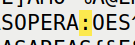

Troca:

```shell
tr '\-$/([;,_~:' 'ADEPIOSMRC' <cipherctf.txt > out.txt
```

Palavra: ADMINISTRACAO

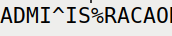

Troca:

```shell
tr '\-$/([;,_~:^%' 'ADEPIOSMRCNT' <cipherctf.txt > out.txt
```

Palavra: MONTAGEM|INTEGRACAO

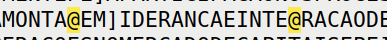

Troca:

```shell
tr '\-$/([;,_~:^%@' 'ADEPIOSMRCNTG' <cipherctf.txt > out.txt
```

Palavra: CONSELHO

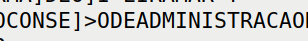

Troca:

```shell
tr '\-$/([;,_~:^%@]>' 'ADEPIOSMRCNTGLH' <cipherctf.txt > out.txt
```

Palavra: PRODUTORES

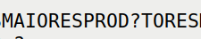

Troca:

```shell
tr '\-$/([;,_~:^%@]>?' 'ADEPIOSMRCNTGLHU' <cipherctf.txt > out.txt
```

Palavra: FUNDAMENTALMENTE|MARFIM|BRASIL

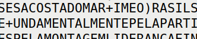

Troca:

```shell
tr '\-$/([;,_~:^%@]>?+)' 'ADEPIOSMRCNTGLHUFB' <cipherctf.txt > out.txt
```

Palavra: ACTIVIDADE|CARACTERIZOU-SE

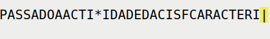

Troca:

```shell
tr '\-$/([;,_~:^%@]>?+)*|' 'ADEPIOSMRCNTGLHUFBVZ' <cipherctf.txt > out.txt
```

Palavra: BAIXO|MARQUES

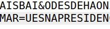

Troca:

```shell
tr '\-$/([;,_~:^%@]>?+)*|=&' 'ADEPIOSMRCNTGLHUFBVZQX' <cipherctf.txt > out.txt
```

- Por fim, o excerto todo decifrado foi o seguinte:

```
AIS BAIXO DESDE HA ONZE MESES A COSTA DO MARFIM E O BRASIL SAO OS MAIORES PRODUTORES MUNDIAIS A ENTRADA FORMAL 
DE OLIVEIRA MARQUES NA PRESIDENCIA DO CONSELHO DE ADMINISTRACAO DA CISF ESTA PARA BREVE DEPOIS DO PEDIDO DE
DEMISSAO DE IDENTICO CARGO OCUPADO NA ALIANCA SEGURADOR ANO ANO PASSADO A ACTIVIDADE DA CISF CARACTERIZOU SE
FUNDAMENTALMENTE PELA PARTICIPACAO NOS PROCESSOS DE AVALIACAO NO AMBITO DO PROGRAMA DE PRIVATIZACOES PELA
MONTAGEM LIDERANCA E INTEGRACAO DE SINDICATOS FINANCEIROS DE NUMEROS AS OPERACOES NO MERCADO DE CAPITAIS E PELA 
ASSESSORIA ESTRATEGICA E CONSULTORIA NAS AREAS{XEXRBETPVSSZZNGV}
```

- E com todos estes processos e análises conseguimos extrair a flag do ctf flag{xexrbetpvsszzngv}