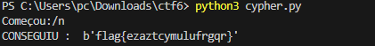
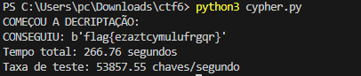

## CTF WEEK11


### Tarefa 1

**Análise:** 

Ao fazer uma análise ao código fornecido, reparámos que muito provavelmente a vulnerabilidade se encontrava na forma como eram geradas as chaves, uma vez que, a maior parte da chave (13bytes) é preenchida com 0x00, e apenas os 3 últimos são gerados aleatoriamente, ou seja "só" existem 16.777.216 combinações possíveis.

Um número tão baixo quando podiam existir 256^16 combinações, sugere que uma abordagem brute force pode facilmente quebrar a encriptação, uma vez que esta é algo fraca.

**Perguntas:**

- Como consigo usar esta ciphersuite para cifrar e decifrar dados?

Utilizar a função gen() para gerar uma chave e com um nonce de 16 bytes, com as funções enc() e dec(), respetivamente, cifrar e decifrar a cifra clássica como a que recebemos.

- Como consigo fazer uso da vulnerabilidade que observei para quebrar o código?

A principal vulnerabilidade é que a chave é muito fraca e bastante previsível,apenas 3 bytes são aleatórios, um simples ataque brute force pode facilmente gerar todas as combinações para esses 3 bytes e decifrar a cifra recebida.

- Como consigo automatizar este processo, para que o meu ataque saiba que encontrou a flag?

Como o criptograma contém o formato habitual flag{xxxxxxxx}, um script python para iterar por todas as combinações dos 3 bytes finais, e depois de tentar decifrar usando a função dec(), verifica se o texto decifrado começa por "flag".

**Algoritmo usado para encontrar a flag:**

Depois de toda a análise feita anteriormente e encontrar o ponto fraco da cifra o algoritmo python que usamos foi o seguinte:

```python
from cryptography.hazmat.primitives.ciphers import Cipher, algorithms, modes
import os
import binascii
from itertools import product

KEYLEN = 16

def gen(): 
	offset = 3 # Hotfix to make Crypto blazing fast!!
	key = bytearray(b'\x00'*(KEYLEN-offset)) 
	key.extend(os.urandom(offset))
	return bytes(key)

def enc(k, m, nonce):
	cipher = Cipher(algorithms.AES(k), modes.CTR(nonce))
	encryptor = cipher.encryptor()
	cph = b""
	cph += encryptor.update(m)
	cph += encryptor.finalize()
	return cph

def dec(k, c, nonce):
	cipher = Cipher(algorithms.AES(k), modes.CTR(nonce))
	decryptor = cipher.decryptor()
	msg = b""
	msg += decryptor.update(c)
	msg += decryptor.finalize()
	return msg

def bfalg(nonceg9, cryptg9):
    print("COMEÇOU A DECRIPTAÇÃO:")
    noncereal = binascii.unhexlify(nonceg9)
    cryptreal = binascii.unhexlify(cryptg9)

    for poss in product(range(256), repeat = 3):
        key = bytes([0]*13 + list(poss))
        decrypt = dec(key,cryptreal, noncereal)

        if decrypt.startswith(b"flag"):
            print("CONSEGUIU: ", decrypt)

nonce = "79ef3746dc1f28322c84462f63b32924"
cryptogram = "be70f389d472df72cdda57e42cae97cc5f7f58aaa2ae"

bfalg(nonce, cryptogram)
```

Basicamente o como explicado em cima, o programa testa todas as possibilidades para os 3 bytes finais, e depois de decifrado vê se aquele texto começa com flag ou não, se começar printa o resultado, que no nosso caso nos permitiu encontrar a flag -> flag{ezaztcymulufrgqr}.




### Tarefa 2

Para o cálculo de quão grande tem de ser o offset para ser inviável num período de 10 anos realizámos alguns passos:

1) 10 anos em segundos = 315 569 260 segundos

2) Número de testes por segundo do nosso código = 53857.55 chaves/segundo

3) Número total de combinações em 10 anos = 16 995 787 198 913

Como sabemos 256^offset dá o número total de combinações possiveis para um determinado offset, ou seja precisávamos de uma expressão deste género:

```
256^offset > Nº total de combinações em 10 anos

offset > log256(Nº total de combinações em 10 anos)
```

Recorrendo a uma calculadora conseguimos perceber facilmente que o offset teria de ser maior do que 5,49, ou seja, se o offset fosse 6, seria inviável para o nosso programa perceber qual era a chave num periodo de 10 anos no pior dos casos.

**Output:**



### Tarefa 3

Usar o nonce com um byte(8 bits) de tamanho, não é uma contra medida eficaz principalmente por 3 razões:

1) O espaço de possibilidades é demasiado pequeno para mitigar ataques, 256 para cada chave candidata;
2) Não resolve a vulnerabilidade da reutilização de nonces no modo CTR;
3) Apesar de adicionar uma sobrecarga ao atacante, é insignificante e não é grande o suficiente para trapalhar o ataque como dito antes.
