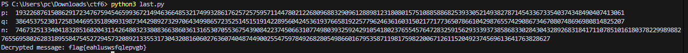

## CTF WEEK12

Como primeiro passo do ctf começámos por criar uma função para conseguir encontrar primos e ao mesmo tempo precisámos de uma para testar a primalidade, para isso usamos o algoritmo Miller-Rabin recomendado:

```python

#Verifica se um número n é primo com o algoritmo criado.
#Dependendo do valor de n, a função escolhe uma lista de bases para o teste.
#Se n for maior que 2.152.302.898.747, a função usa um número aleatório de bases (k=10).

def check_prime(n, bases=None):
    if n <= 1:
        return False
    if n in (2, 3):
        return True
    if n % 2 == 0:
        return False
    
    r, d = 0, n - 1
    while d % 2 == 0:
        r += 1
        d //= 2

    if bases is None:
        if n < 2047:
            bases = [2]
        elif n < 1373653:
            bases = [2, 3]
        elif n < 25326001:
            bases = [2, 3, 5]
        elif n < 118670087467:
            bases = [2, 3, 5, 7, 11]
        elif n < 2152302898747:
            bases = [2, 3, 5, 7, 11, 13]
        else:
            return miller_rabin_random(n, k=10)

    for a in bases:
        if a >= n:
            break
        if not miller_rabin_witness(a, d, n, r):
            return False
    return True


#Cerificar se a é uma testemunha de que n não é primo.
#Calcula x = a^d % n e verifica se x é 1 ou n-1.
#Se x não for 1 ou n-1, a função continua a elevar x ao quadrado até r-1 vezes para verificar se x se torna n-1.

def miller_rabin_witness(a, d, n, r):
    x = pow(a, d, n)
    if x == 1 or x == n - 1:
        return False
    for _ in range(r - 1):
        x = pow(x, 2, n)
        if x == n - 1:
            return False
    return True

#Testa com k bases aleatórias para verificar se n é primo.

def miller_rabin_random(n, k):
    for _ in range(k):
        a = random.randint(2, n - 2)
        if miller_rabin_witness(a, n - 1, n, (n - 1).bit_length() - 1):
            return False
    return True
```

E com estas funções conseguimos implementar a função para localizar os primos mais próximos de 2^nossooffset e que multiplicados são iguais a n:

```python
def locate_primes(n, offset, limit=100000000):
    t = 500 + offset
    p_guess = 2 ** t
    
    for dp in range(0, limit):
        p = p_guess + dp
        if check_prime(p):
            q = n // p
            if n % p == 0 and check_prime(q):
                return p, q
    raise ValueError("Primes not found within the specified range.")
```


Depois disto implementámos as duas funções que nos faltavam para conseguir implementar a decriptação completa:


```python

#Calcula o máximo divisor comum de a e b, e também os coeficientes que são usados para encontrar o inverso modular.

def gcd_extended(a, b):
    if b == 0:
        return a, 1, 0
    g, x1, y1 = gcd_extended(b, a % b)
    x = y1
    y = x1 - (a // b) * y1
    return g, x, y


#Usa o gcd_extender para encontrar o inverso modular 

def mod_inv(e, ed):
    g, x, _ = gcd_extended(e, ed)
    if g != 1:
        raise ValueError("Modular inverse does not exist")
    return x % ed
```


Por fim conseguimos implementar a nossa função rsa_decrypt, que usa a função para localizar primos, e depois usa o inverso modular para desencriptar a flag:

```python
def rsa_decrypt(ciphertext_hex, n, e, offset):
    p, q = locate_primes(n, offset)

    print("p: ", p)
    print("q: ", q)
    n = p*q
    print("n: ", n)

    ed = (p - 1) * (q - 1)
    d = mod_inv(e, ed)
    
    ciphertext = int.from_bytes(binascii.unhexlify(ciphertext_hex), "little")
    
    plaintext_int = pow(ciphertext, d, n)
    plaintext_bytes = plaintext_int.to_bytes((plaintext_int.bit_length() + 7) // 8, 'little')
    
    return plaintext_bytes.decode()

n = 7467325133404183285160204311426480323380836638603613165307055367543908422374506631077498039325924291054180237655457647283259156293339373858683302843043289268318417110785101618037822998988276556958026283189558475452729457320892133553173043208160602763607404874490025547597849268280549866016795358711981759822006712611520492374569613641763828627
e = 65537
ciphertext_hex = "0951fb834a443a3d91b0b5ed011564cb37968e9807fa19c0d1b4f9092cd34981400512d718d3dca1b4fc12a3a2ae4c9ee2e0e1118ac3360656b31d1d7538799a7619fade9fafb0c6d80e601d2136722cf321d2ea49d6a7634e7b4de54b07a9b7d883adbbcd14f1eac58ba71b259227294cf8dc77e2f62b0eb2073f55fabac6cbee9d6aed28d045f3a9a4a19051ea010000000000000000000000000000000000000000000000000000000000000000000000000000000000000000000000000000000000000000000000000000000000000000000000000000000000000000000000000000000000000000000000000000000000000000000000000000000000"
t = 14
g = 9
offset = ((t-1)*10+g) // 2

try:
    plaintext = rsa_decrypt(ciphertext_hex, n, e, offset)
    print("Decrypted message:", plaintext)
except ValueError as ve:
    print("Error:", ve)
```

E com isto conseguimos obter a flag -> flag{eahluswsfqlepvgb}

E os números primos são:

```shell
p:  1932268761508629172347675945465993672149463664853217499328617625725759571144780212268096883290961288981231808015751088588682539330521493827871454336733540374348490407413061
q:  3864537523017258344695351890931987344298927329706434998657235251451519142289560424536193766581922577962463616031502177177365078661042987655742908673467080748696980814825207
```




### Questões


- Como consigo usar a informação que tenho para inferir os valores usados no RSA que cifrou a flag?

Ao usar a função implementada, locate_primes, de forma a encontrar os primos p e q que foram usados para gerar n com o algoritmo Miller-Rabin. E depois calcular o módulo inverso com a função mod_inv com o expoente público e ed = (p-1) * (q-1).

- Como consigo descobrir se a minha inferência está correta?

Temos de verificar se p * q == n para garantir que os primos encontrados estão corretos, caso contrário não é a solução que queremos, e depois com o módulo inverso e com o n tentarmos desencriptar a flag dada e ver se dá certo.

- Finalmente, como posso extrair a minha chave do criptograma que recebi?

Ao usar a nossa função rsa_decrypt com os valores de n, e, e o texto cifrado em hexadecimal, a função vai retornar o texto desencriptado, que contem a chave se nada der errado. E claro é também importante todos os valores encontrados acima, como por exemplo o módulo inverso, se esta algoritmo estiver errado a desencriptação não funciona.