# Logbook 11

## Task 1

- Começámos por seguir os primeiros passos do guião e copiar o ficheiro OpenSSL, descomentar a linha que contém "unique_subject" e também criar todo o ambiente para o certificate authority.

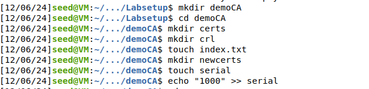


- O segundo passo foi gerar um certificado "self-signed" , certificado x.509 e uma chave privada RSA de 4096 bits


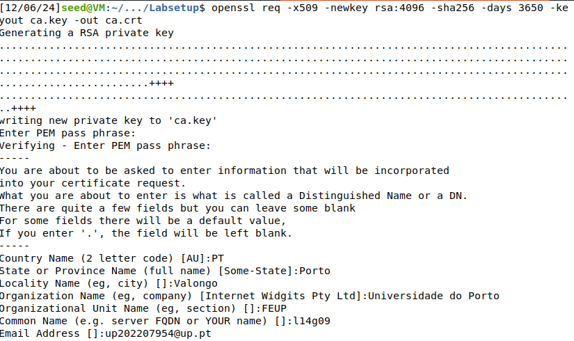

### Questões

Para responder às questões corremos os seguintes dois comandos:

```shell
openssl x509 -in ca.crt -text -noout
openssl rsa -in ca.key -text -noout
```

- Que parte do certificado indica que este é um certificado CA?

Percebemos isso pois nas basic constraints encontrámos isto:

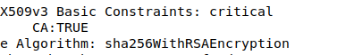


- Que parte do certificado indica que este é um certificado "self-signed"?

O campo subject e issuer são similares.

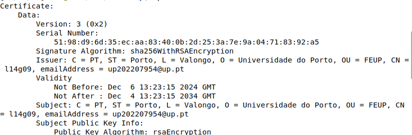

- No algoritmo RSA, temos um expoente público e, um expoente privado d, um módulo n e dois números secretos p e q, tais que n = pq. Identifica os valores desses elementos no teu certificado
e arquivos principais.

- expoente público (e)

```
65537 (0x10001)
```

- expoente privado (d)

```
0b:b1:85:98:48:d3:82:7d:d7:4f:5a:0d:15:bb:6c:
65:ad:0a:ba:ea:f2:81:8e:2a:d6:d7:43:cd:0a:ab:
6c:94:c2:d4:78:5a:41:85:ed:70:44:fd:44:02:10:
7c:70:b0:ad:e5:a2:bc:fd:85:28:6b:96:f2:d6:b6:
66:a6:32:65:25:ef:bb:b8:4c:ec:79:0a:62:8f:dc:
37:b1:a9:85:25:92:89:18:2b:ae:9c:c2:27:5c:43:
96:30:f1:d6:6a:ad:80:fe:f8:75:9e:35:f0:cf:3b:
23:5c:0e:5b:cc:2a:f5:e9:ba:65:68:90:fa:c5:49:
c4:5a:cd:95:fa:6c:97:e0:1a:f9:fb:16:df:58:3d:
70:47:fa:a3:bb:2f:b6:0b:f1:4a:4a:fb:73:17:7a:
63:c8:fc:3f:bd:70:90:11:03:33:f8:23:12:56:06:
08:d4:25:68:82:1c:da:f9:24:8a:f4:99:7f:08:c9:
9d:c4:8f:2c:d0:08:c5:80:3a:eb:e7:a4:1d:ae:2c:
74:89:37:84:14:8a:d2:93:de:de:47:05:e1:15:a8:
d7:9b:4f:4e:70:a0:6d:de:65:43:01:9f:db:f8:43:
3c:75:5f:7c:bc:62:24:a9:58:b3:23:84:5d:b6:ee:
ee:c4:e6:df:04:0b:6f:fc:6d:f8:66:06:ed:5e:56:
3e:75:a3:22:7e:dd:50:c0:cb:17:86:03:ae:dc:88:
80:32:9d:18:1a:36:dc:6b:e4:bd:8b:0f:a4:29:6b:
73:d8:09:e5:95:a3:7f:4a:ac:c9:93:5f:00:77:80:
5b:52:07:19:6e:b9:1d:6c:e5:f0:23:3e:7f:59:f3:
3d:84:b4:f3:af:1c:9b:81:4b:03:08:2f:c2:c3:ed:
a9:e4:0a:6b:d5:e3:ea:5e:38:69:3f:2c:04:94:b5:
58:4d:30:11:10:c1:10:7c:6b:2f:f3:8c:8d:d7:38:
08:e6:f4:99:d0:f8:00:d1:df:65:6e:e4:71:9d:d7:
60:9e:b0:60:48:7b:0c:d2:55:84:d3:4e:1b:36:e7:
98:69:70:6f:5d:2a:ef:a0:46:bc:4a:ed:60:f2:38:
a8:12:20:71:55:62:1d:ee:aa:b3:23:01:0c:51:0c:
ee:52:28:14:df:3b:50:4e:7d:36:80:6e:0b:ff:21:
df:ff:11:03:ec:89:a5:eb:7a:bc:f4:c3:3e:40:ee:
59:84:fa:6e:18:7b:3e:51:4d:25:d4:14:dc:4d:57:
6a:19:f8:94:e5:4f:61:15:10:90:30:57:0e:af:2a:
25:24:a4:c2:88:3e:9c:02:8a:69:cf:1e:4a:b6:cb:
27:ab:2a:cb:fc:ab:17:c6:ea:06:ee:ec:b2:4f:e4:
1b:41
```

- módulo (n)

```
00:c1:ea:51:7a:32:83:53:00:a2:89:ef:2f:a9:7d:
8b:fd:80:8b:65:f0:49:5c:49:5a:7e:94:e6:5e:37:
7a:c4:ef:60:fc:94:20:c4:ef:59:88:f7:8c:80:79:
8d:e5:20:fa:b9:ee:6b:f5:a7:01:6b:d6:80:6a:99:
fd:c1:97:e7:dc:43:af:43:e3:8a:27:c5:5e:07:eb:
31:33:af:3c:8d:ee:e0:d2:0d:c8:78:c6:02:56:f5:
4e:ed:a3:3d:a0:6c:0b:1e:dd:5f:a6:43:14:aa:4f:
8b:0c:e7:3c:9f:41:bb:ba:dc:c7:f9:f9:28:a3:20:
6c:6a:03:3c:29:f9:f2:ac:df:04:cc:92:31:63:70:
c3:66:f5:4e:7d:c9:4a:b4:0e:fc:42:17:2c:71:29:
4b:5a:63:80:0c:07:46:50:f1:b3:a0:58:8d:a2:45:
fb:c7:a7:c9:e3:77:89:a8:4a:97:95:d6:d4:b4:7c:
ee:ce:22:01:20:14:0d:d5:0d:80:44:92:23:95:65:
30:e3:58:e0:bb:56:fd:5a:15:db:dd:24:8b:68:64:
24:19:24:b9:1e:0d:66:82:83:d4:8f:79:72:e3:81:
80:d2:f4:56:29:30:a3:d3:24:1a:b8:3d:a2:cc:e8:
fb:2f:ec:ac:4d:67:48:cf:cc:0b:b6:ac:01:41:a2:
f4:66:02:2c:aa:75:9a:77:87:40:ad:21:61:7a:36:
35:33:3a:8b:d0:00:dc:76:8a:eb:7d:dc:2e:2f:d0:
4f:fb:eb:36:89:f0:11:ec:84:46:71:9e:d0:e7:56:
6b:28:ab:88:5a:ca:d6:7f:43:2b:bf:3d:43:4e:98:
40:43:a0:8a:26:b0:9f:36:32:72:9d:8b:b4:f1:87:
64:79:55:ef:1e:e2:48:a2:e1:7d:8b:28:bc:ae:df:
84:62:bb:6c:22:dd:42:83:bb:d9:5a:60:fe:58:06:
e3:93:e9:af:5c:61:e0:a5:65:a2:75:37:be:53:b9:
bb:bc:f8:f4:b6:36:2a:0c:c8:06:17:8f:11:da:ad:
1c:c0:ad:03:cf:ca:80:04:8e:bd:8b:2d:51:cd:94:
20:58:68:69:b2:d7:b3:36:ab:2a:1a:1c:5f:5d:6e:
79:e5:bc:0e:e3:bb:3d:9a:69:a1:04:99:0b:78:d9:
13:41:0f:7f:de:4f:fb:52:80:db:11:8d:19:b6:55:
58:2f:88:48:01:39:b5:e7:53:b2:66:13:6e:12:53:
b7:de:3e:48:1f:e2:24:5e:ed:ce:dd:45:39:8e:01:
05:34:81:be:d3:ba:76:a4:5e:d3:8d:19:12:13:03:
88:51:62:1a:f9:0e:87:98:80:0d:a0:f8:95:29:da:
df:c2:35
```

- número secreto (p)

```
prime1:
00:e2:57:48:eb:c1:a6:30:cc:1e:d0:5c:f4:51:10:
3c:0a:ec:31:f8:02:73:ed:56:59:70:3e:36:24:12:
d0:4b:ba:95:8a:47:92:f5:6e:33:d7:0d:3f:38:c1:
e3:fe:6a:8b:a5:69:6f:04:8d:1b:bb:48:07:2a:28:
87:08:98:83:0a:f9:0b:10:87:64:a9:36:96:9c:e7:
38:12:aa:9d:d3:3c:ed:ce:09:1d:e6:db:62:f4:f1:
fb:a6:05:c8:3a:8e:a6:f9:3a:fc:20:1d:d1:69:48:
8d:20:9e:46:4e:27:f4:61:9d:84:c5:85:09:ad:0e:
8b:ce:4c:fd:51:b0:2f:6d:53:61:f7:3b:f2:d1:9f:
8f:9a:82:47:6b:46:a3:7c:b0:4b:dd:9d:c3:70:be:
a1:e7:a0:d8:13:ae:e2:7f:8d:ce:ab:5f:f3:5b:35:
78:63:66:a9:71:76:79:ae:4f:64:12:24:b9:79:cb:
d4:0f:90:03:f7:2f:83:05:14:56:cf:6e:f6:62:b3:
52:22:7c:c0:87:37:1d:43:7d:6b:1f:2d:62:07:03:
99:44:a0:80:f2:cb:16:e7:8b:18:64:55:bf:82:39:
02:00:bf:8e:b2:25:3a:7e:1d:61:11:f1:f6:52:c5:
d6:e7:65:e5:d4:76:79:2e:74:11:fc:6e:f2:a8:b5:
6d:1f
```

- número secreto (p)

```
prime2:
00:db:53:4c:ae:22:6d:f6:55:f5:e3:77:40:70:96:
26:24:65:eb:4b:40:30:0a:55:4e:ed:ac:a8:3e:66:
ce:1e:13:6d:b0:dc:af:b3:5f:bd:40:78:c8:dc:4f:
f3:ad:ff:02:97:44:e4:53:21:6b:fb:55:47:eb:55:
70:6b:37:92:cd:03:cb:ea:90:c5:a2:0d:b5:e2:2b:
84:85:51:fc:5f:e7:6a:50:6c:b0:22:72:27:98:0c:
e5:5d:68:8a:42:2d:0b:90:1d:0c:74:ec:df:81:3d:
bd:43:87:30:a9:e3:11:cd:12:f9:e2:8e:3e:80:2c:
c6:05:47:66:70:b2:86:76:87:c0:6c:1d:84:08:e9:
06:82:e7:91:da:ed:ed:4c:b7:71:fd:32:c0:93:bb:
37:5b:f5:32:7c:47:7b:81:13:5e:3e:fa:46:b3:50:
e7:b4:7c:3d:f5:d0:7c:56:f1:f3:98:39:e4:dd:dc:
ba:ab:eb:83:71:d3:f1:5a:91:53:21:26:ed:47:da:
15:26:50:c1:06:e0:cf:78:24:f8:cd:36:4c:a8:b4:
d2:e0:9b:41:ca:cb:e9:6b:ba:9e:78:c6:d9:7e:39:
c7:d4:4e:9c:49:8a:24:5c:ab:01:f3:f1:df:36:14:
74:e3:3a:4f:e4:9e:d3:87:60:b1:a4:da:79:bf:bd:
d2:2b
```

## Task 2

- Basicamente a tarefa 2 permitiu nos perceber como criar um pedido CA para o nosso servidor, o ficheiro .csr inclui a chave pública e as informações do servidor, e o .key as chaves públicas e privadas.

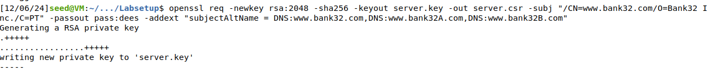


## Task 3

- Na tarefa 3 o objetivo gerar um certificado assinado para o servidor a partir de um Certificate Signing Request (CSR)

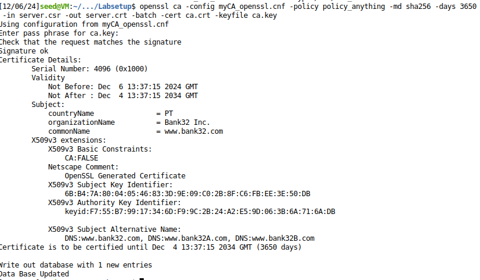

- E ao abrirmos o ficheiro .crt:

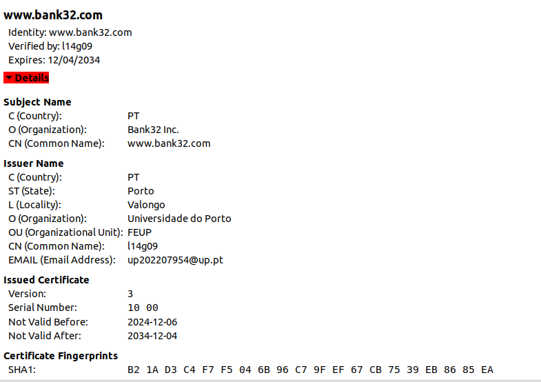

- Com o seguinte comando, conseguimos ainda ver que o certificado abrange os nomes alternativos para o website que demos na task 2 e as informações:

```shell
openssl x509 -in server.crt -text -noout
```

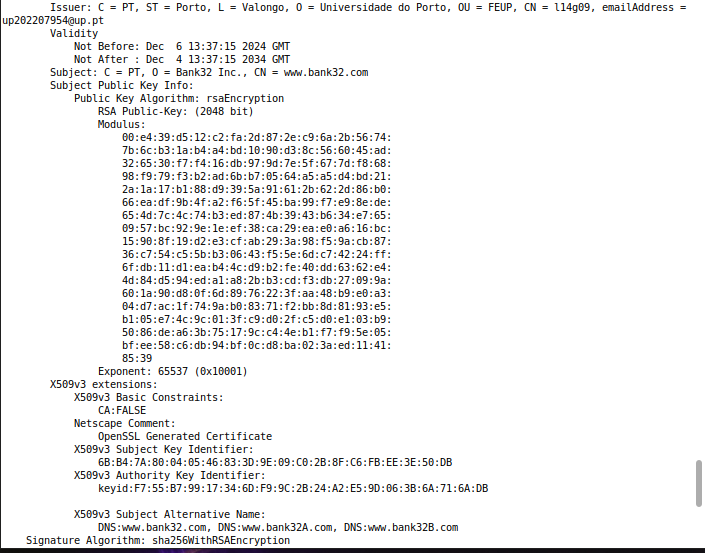

## Task 4

- Inicialmente colocamos os ficheiros do servidor .crt e .key, com o nome bank32 e passámos para o diretório volumes, que é um diretório partilhado

- Seguidamente abrimos um terminal dentro do container,acedemos a este diretório: /etc/apache2/
sites-available e abrimos o ficheiro bank32 apache ssl.conf, e realizámos algumas trocas, rpincipalmente para apontar a localização dos ficheiros .crt e .key

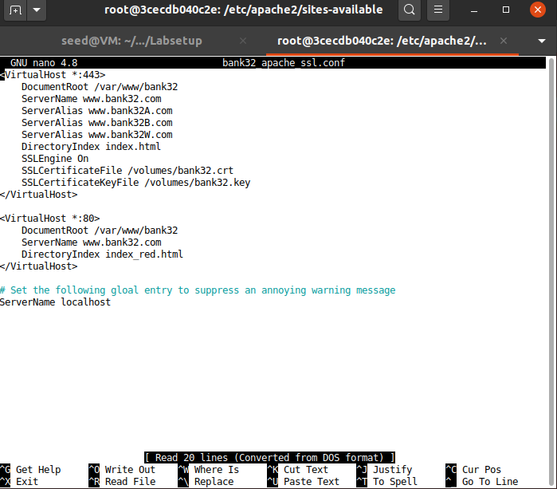


- Depois destas alterações corremos os comandos para iniciar o servidor apache:

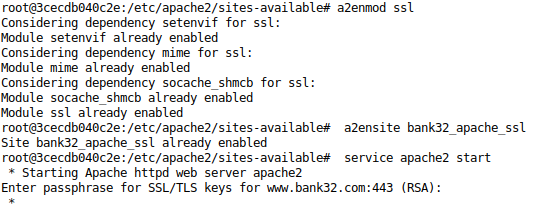

- E finalmente conseguimos aceder ao site www.bank32.com, mas a ligação não era segura:

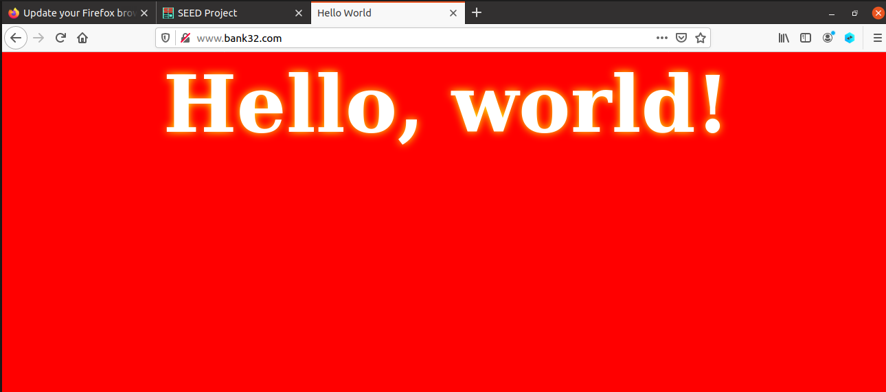

- Então tivemos de aceder ao menu de preferências e segurança do firefox, e adicionar o nosso certificado criado no início, como explicado no guião.

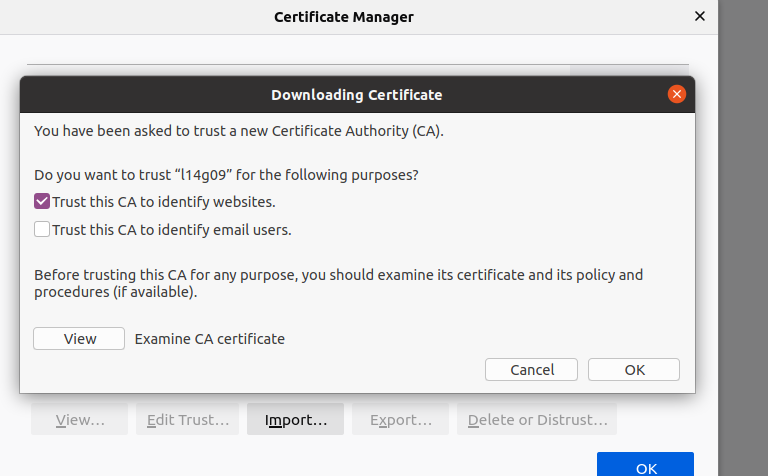

- Por fim conseguimos ver que o nosso site já é seguro

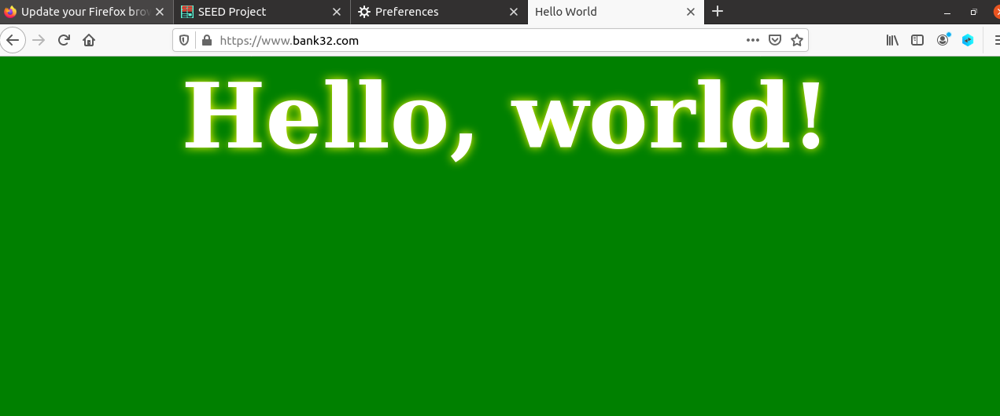

## Task 5

- No primeiro passe começámos por trocar o nome do servidor para www.example.com

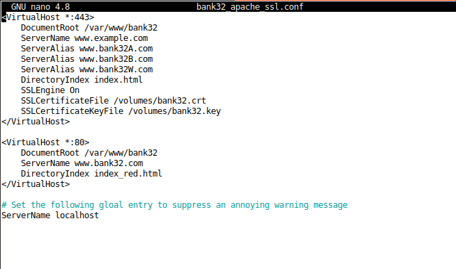

- Seguidamente nos hosts colocámos o site example, a apontar para o mesmo ip do bank32

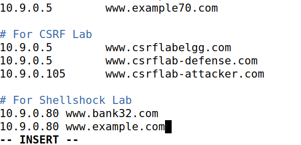

- Depois de dar restart ao server apache, mal tentámos abrir o site example.com é exibido um alerta de que se o utilizador prosseguir pode vir a ter os seus dados roubados, o que era de esperar pois quando criámos o certificado não colocámos lá o site example.com:

```shell
-addext "subjectAltName = DNS:www.bank32.com,\ 
                                    DNS:www.bank32A.com,\
                                    DNS:www.bank32B.com"
```

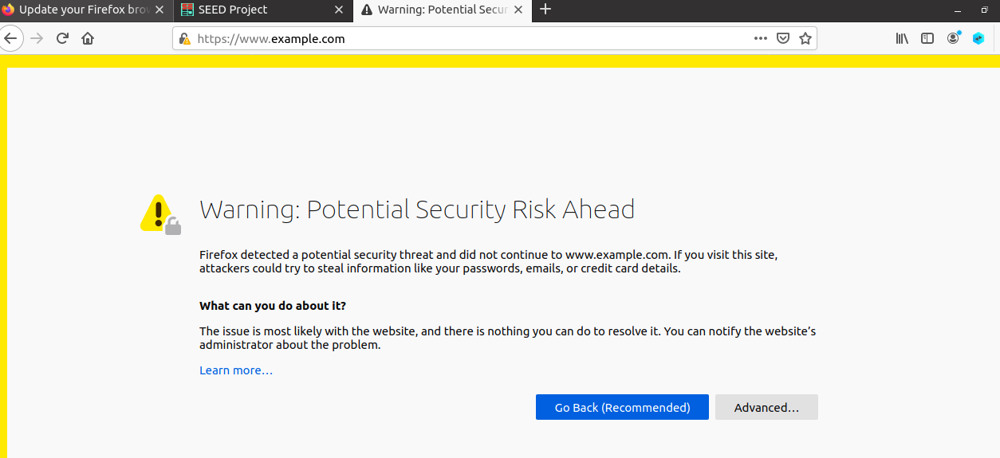

- Ao prosseguir mesmo depois do aviso, encontrámos o example.com tal como o bank32, mas neste caso o example.com tem um aviso de que o website não é seguro

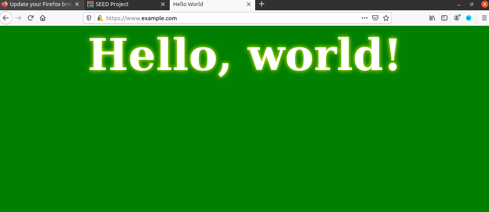

**Conclusões** Conseguimos perceber através desta tarefa que uma ataque mitm é "bloqueado" pois o utilizador é alertado que o site não é seguro e que lhe podem ser roubadas informações, ou seja se o certificado não for válido, não serve de nada alterar outros parametros porque irá ser alertado ao utilizador a falta de segurança.


## Task 6

- Inicialmente começámos por recriar os passos das primeiras tarefas, ou seja criar um certificado e uma key para o servidor para mais tarde mudar no apache, com os seguintes comandos:

```shell
openssl req -newkey rsa:2048 -sha256 -keyout example.key -out example.csr -subj "/CN=www.example.com/O=example Inc./C=PT" -passout pass:grupo9
```

```shell
openssl ca -config myCA_openssl.cnf -policy policy_anything -md sha256 -days 3650 -in example.csr -out example.crt -batch -cert ca.crt -keyfile ca.key
```

- Seguidamente mudámos o apache, para aceitar o certificado malicioso juntamente com a key criada anteriormente.

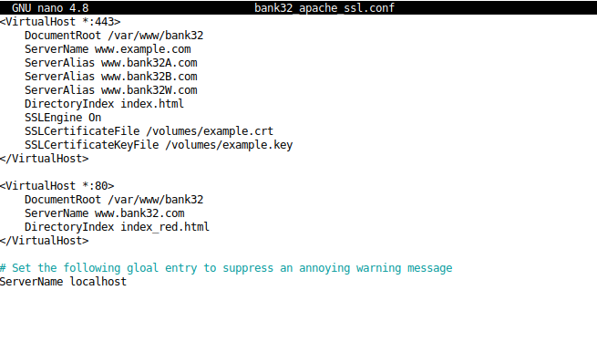

- Depois disto, ao tentar aceder ao site example.com, desta vez não recebemos nenhum aviso de insegurança, como na task 5, ou seja o ataque mitm foi realizado com sucesso.

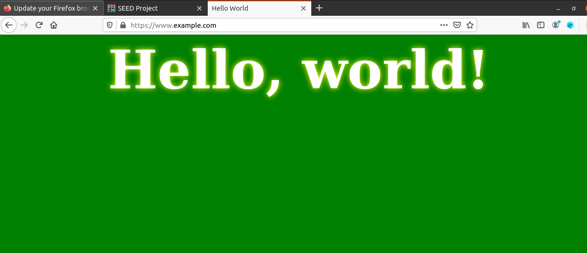


## Questão 2

- Um mecanismo para reagir ao comprometimento de uma CA é o OCSP (Online Certificate Status Protocol), que permite verificar em tempo real se um certificado foi terminado ou rejeitado ou anulado.

- Um adversário pode tentar contornar esses mecanismos manipulando respostas OCSP, explorando certificados emitidos antes da anulação ou falsificando registos de transparência, dificultando a detetção de ataques.


