# Logbook 13

## Task 1

- Para a task 1.1 A e 1.1 B começámos por configurar este script python dado no guião para conseguir caputarar os pacotes com scapy, e para isso tivemos de trocar a interface.

```python
#!/usr/bin/env python3
from scapy.all import *

def print_pkt(pkt):
    pkt.show()

pkt = sniff(iface='br-7a926d308972', filter='icmp', prn=print_pkt)
```

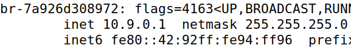

## Task 1.1 A

- O primeiro passo desta tarefa foi mudar as permissões o ficheiro sniffer.py onde se encontrava o script inicial para ser executável, com este comando:

```shell
 chmod a+x sniffer.py
```

- Seguidamente abrimos duas linhas de comando em dois containers diferentes, um no seed attacker e outro no host A:

```shell
docksh 0362c273b4f4
```

```shell
docksh 10f5cbe26e99
```

- No container host A executámos o comando "ping 10.9.0.6(ip do host B)" e no container do seed attacker executámos o script criado, e conseguimos com que os pacotes fossem "sniffed" quando passavam pela interface de rede, onde conseguimos ver as diferentes camadas:

    - Ethernet, onde tem o mac de destino e de origem, e também o tipo do protocolo.
    - IP, onde o mais importante é o ip destino e origem, mas contém outros campos como tamanho e id(30530 para echo-request, 49860 para echo-reply)
    - ICMP, onde o mais importante é o tipo que pode ser echo-request ou echo-reply, e o id e o seq que estão associados ao ping
    - Raw, contém a carga útil do pacote 

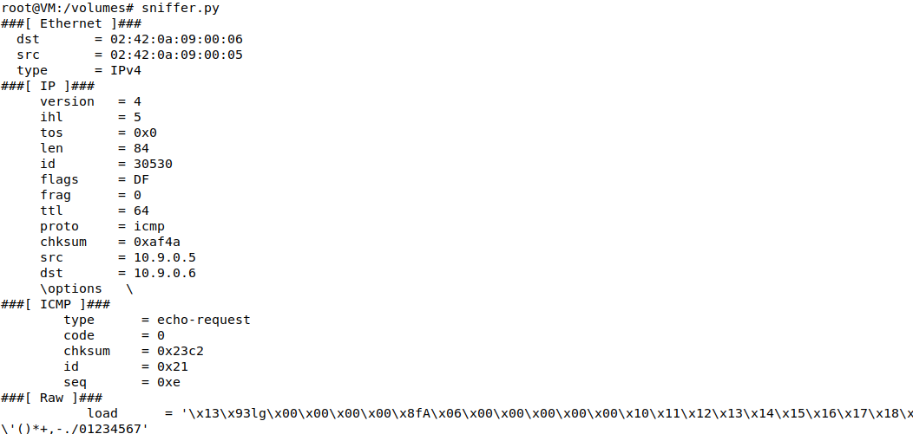

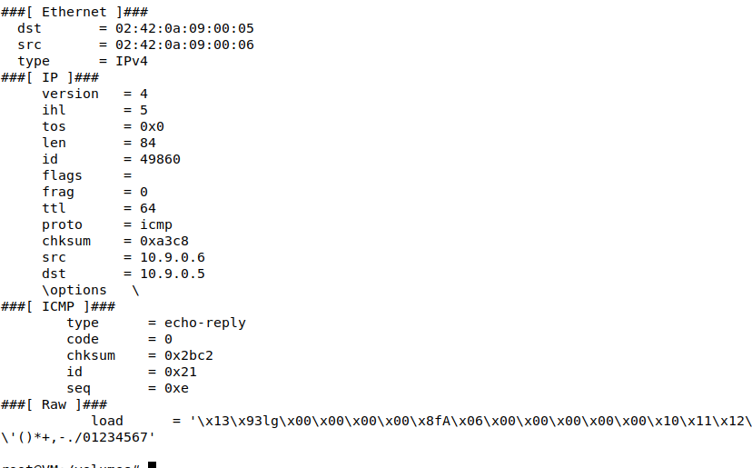

- Depois de utilizarmos o comando "su seed" no container seed-attacker, e tentarmos utilizar o mesmo procedimento, deu um erro por falta de permissões como já era esperado, uma vez que a operação precisa de permissões elevadas.

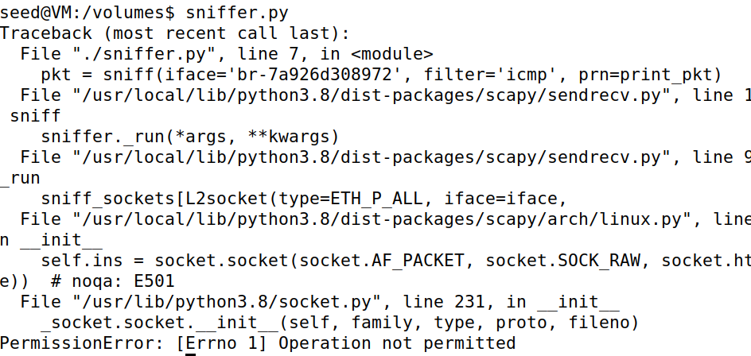

## Task 1.1 B

- Pacotes ICMP

O filtro que estava no script dado no guião já fazia só aparecer pacotes icmp

```python
pkt = sniff(iface='br-7a926d308972', filter='icmp', prn=print_pkt)
```

E portanto as prints são as mesmas da task 1.1 A


- Pacote TCP

Para os pacotes tcp tinhamos de forçar o scapy a detetar pacotes tcp que viessem do host A (10.9.0.5) e com destino à porta 23, e para isso pesquisámos na internet como é que conseguimos filtrar para só serem detetados esses pacotes e obtivemos este filtro:

```python
filter = 'tcp and src host 10.9.0.5 and dst port 23'
```

Ficando com o script assim:

```python
#!/usr/bin/env python3
from scapy.all import *

def print_pkt(pkt):
    pkt.show()

pkt = sniff(iface='br-7a926d308972', filter='tcp and src host 10.9.0.5 and dst port 23', prn=print_pkt)
```

Para testar o funcionamento do filtro no host A enviamos a seguinte mensagem para o host B direcionado à porta 23:

```shell
echo "teste pacotes tcp" > /dev/tcp/10.9.0.6/23
```

E conseguimos obter o resultado esperado de capturar pacotes telnet a vir de um determinado ip e direcionado a uma certa porta, e é comprovado pelo facto da porta de destino da camada tcp ser "telnet" que por padrão está na porta 23.

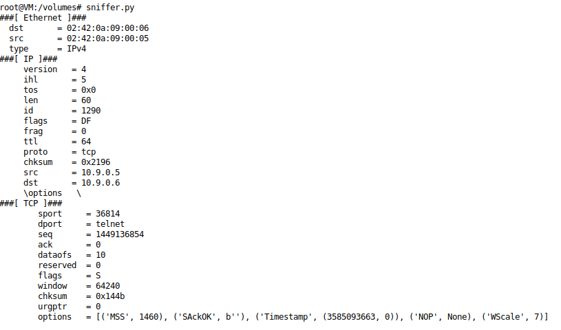

- Pacotes subnet

Começámos por escolher a seguinte subnet:

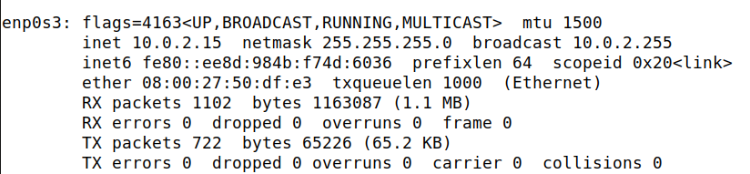

Como o netmask era 255.255.255.0 e a interface era 10.0.2.15, conseguimos obter a subnet 10.0.2.0/24

E de seguida mudámos o script para isto:

```python
#!/usr/bin/env python3
from scapy.all import *

def print_pkt(pkt):
    pkt.show()

pkt = sniff(iface='br-7a926d308972', filter='net 10.0.2.0/24', prn=print_pkt)
```

E com comandos telnet e ping conseguimos ver a captura de pacotes icmp e tcp

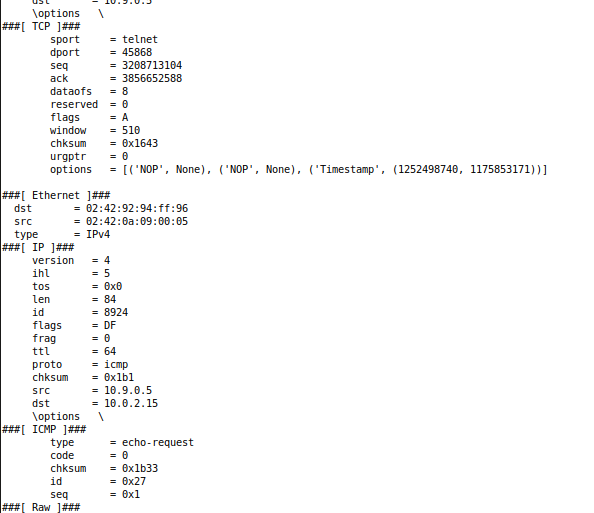

## Task 1.2

1) Criar um objeto da classe IP

```python
a = IP()
```

2) Alterar o destino e a origem do objeto IP

```python
a.src = '10.9.0.5' # host A
a.dst = '10.9.0.6' # host B
```

3) Criar um objeto da classe ICMP

```python
b = ICMP()
```

4) Empilhar o objeto IP juntamente com um objeto de classe ICMP para formar um pacote

```python
pack = a/b
```

5) Enviar o pacote

```python
send(pack)
```

Depois destes passos explicados no guião, corremos o script:

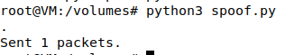

Por fim no wireshark decidimos detetar os pacotes que circulavam na interface de rede,onde conseguimos que o ataque foi bem sucedido uma vez que tinhamos o request na linha 7 e o reply na linha 8, o que prova que conseguimos enviar pacotes como se fossemos o host A, no log seguinte:

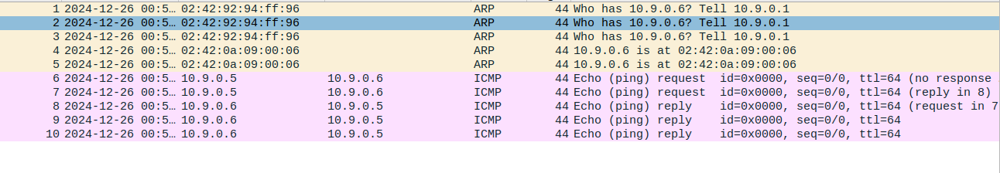


## Task 1.3

- O objetivo desta tarefa foi implementarmos o nosso prórpio traceroute.

Script criado:

1) Criar um objeto IP, de modo a que o seu destino seja o endereço IP pretendido e o TTL seja 1

```python
a = IP(dst=sys.argv[1], ttl=1)
```

2) Criar um while infinito, que cria um pacote, envia o e ainda recebe o primeiro pacote que que é enviado como resposta. Ainda verifica se o ICMP teve algum erro e se tiver incrementa o ttl se não sai do loop infinito

```python
while True:
    b = ICMP()
    pack = a / b
    r = sr1(pack, timeout=1, verbose=0)
    
    if r == None or (r[ICMP].type == 11 and r[ICMP].code == 0): 
        a.ttl += 1
        continue

    break
```

3) Por fim dá print ao ttl

```python
print("Distance: ", a.ttl)
```

4) 

```python
#!/usr/bin/env python3
import sys
from scapy.all import *

a = IP(dst=sys.argv[1], ttl=1)

while True:
    b = ICMP()
    pack = a / b
    r = sr1(pack, timeout=1, verbose=0)
    
    if r == None or (r[ICMP].type == 11 and r[ICMP].code == 0): 
        a.ttl += 1
        continue

    break
    
print("Distance: ", a.ttl)
```

Por fim testámos o ip do google com o traceroute da consola e a nossa implementação:

1) Traceroute

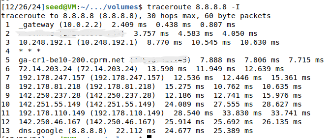


2) Nossa implementação

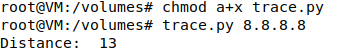

## Task 1.4

Nota: A tarefa 4 foi realizada mais tarde e por isso a interface é diferente das restantes tarefas.

Script realizado:

1) Percebemos que tinhamos de filtrar por pacotes ICMP tal como na 1º tarefa e portanto ficámos com 1 parte certa do script

```python
pkt = sniff(iface='br-45ca787d27ef', filter='icmp', prn=send_r)
```

2) Seguidamente tinhamos de ver se o tipo do pacote ICMP era echo request que era o que nos interessava, e como já tinhamos visto na primeira tarefa ao analisar a camada ICMP, se o type for 8 é echo request, portanto conseguimos obter a seguinte condição

```python
if pkt[ICMP].type != 8:
    		return
```

3) Criar um objeto ip para a camada IP do pacote de resposta, e como o objetivo era fazer nos passar pelo destino final, tivemos de trocar o ip de origem e final.

```python
ip = IP(src = pkt[IP].dst, dst = pkt[IP].src)
```

4) Da mesma forma criar um objeto icmp para a camada icmp do pacote de resposta, e de forma a evitar que fossem acionadas medidas de segurança, tinhamos de replicar exatamente o número de sequenica e o id do pacote original.

```python
icmp = ICMP(type = 0, id = pkt[ICMP].id, seq = pkt[ICMP].seq)
```

5) Por fim no que toca às camadas, preparamos os dados que iam ser enviados no pcaote, copiando os do pacote original

```python
data = pkt[Raw].load	
```

6) Finalmente criámos o nosso pacote de resposta final juntando todas as camadas anteriormente criadas.

```python
r = ip / icmp / data
send(r, verbose = 0)
```

Ficando assim com o seguinte script:

```python
#!/usr/bin/env python3
from scapy.all import *


def send_r(pkt):
	if pkt[ICMP].type != 8:
    		return
    		
	ip = IP(src = pkt[IP].dst, dst = pkt[IP].src)


	icmp = ICMP(type = 0, id = pkt[ICMP].id, seq = pkt[ICMP].seq)
	
	data = pkt[Raw].load
	
	r = ip / icmp / data
	send(r, verbose = 0)


pkt = sniff(iface='br-45ca787d27ef', filter='icmp', prn=send_r)
```

### Testes e explicações

O primeiro passo foi mais uma vez abrir um terminal dentro de cada container, um no seed attacker e outro no host A.

- 1.2.3.4

Quando testado com o nosso programa obtivemos os seguintes resultados:

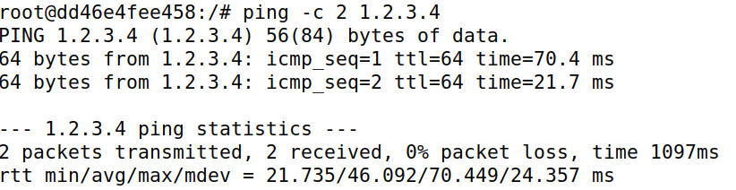

Quando testado sem o nosso programa o seguintes:

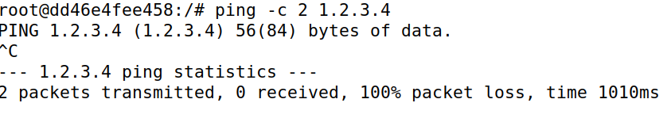

Explicações:

Primeiramente é importante perceber que quando uma máquina tenta enviar pacotes para outra, primeiro tem de ver o mac de destino, se não o conseguir o procedimento é enviar um broadcast,enviar para todos os canais ,para que consiga descobrir qual é que é o endereço mac destino.

Ao fazermos o comando ip route get, e vimos que existe um "via 10.9.0.1" o que indica que os pacotes para chegar do host A à internet precisam de passar pela máquina seed-attacker, o que prova que os pacotes foram falsificados.

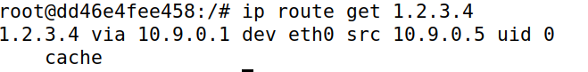

Seguidamente vimos a caputra do wireshark que comprova que foi enviado um broadcast para obter o mac da máquina seed-attacker.

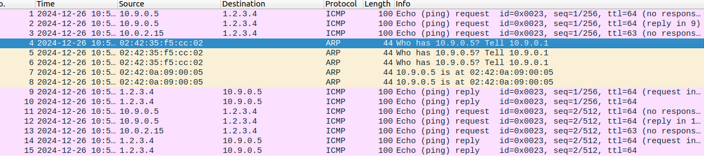


- 10.9.0.99

Quando testado com o nosso programa obtivemos os seguintes resultados:

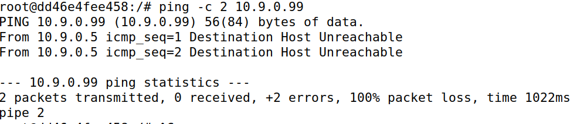

Quando testado sem o nosso programa os seguintes:

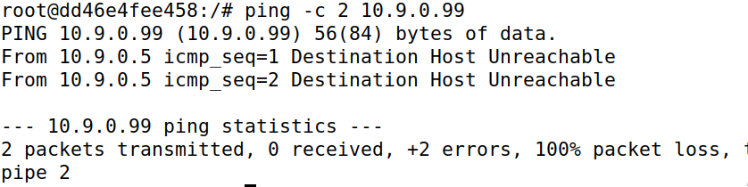

Explicações:

Primeiramente é importante perceber que quando uma máquina tenta enviar pacotes para outra, primeiro tem de ver o mac de destino, se não o conseguir o procedimento é enviar um broadcast,enviar para todos os canais ,para que consiga descobrir qual é que é o endereço mac destino.

Ao fazermos o comando ip route get, percebemos logo o porquê de nem com o programa nem sem programa não funcionar quando fazemos ping ao ip, uma vez que, tinha só "src 10.9.0.5". Explica se pelo facto de o "10.9.0.99" estava na mesma rede local, ou seja não precisou de passar pela máquina seed-attacker, ou seja , podemos perceber que o nosso programa não foi útil neste caso.

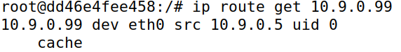

Fico comprovado que o programa não foi útil pela log do wireshark, uma vez que, é enviado um broadcast para saber o mac do host A

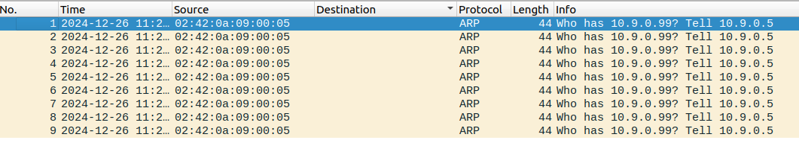

- 8.8.8.8

Quando testado com o nosso programa obtivemos os seguintes resultados:

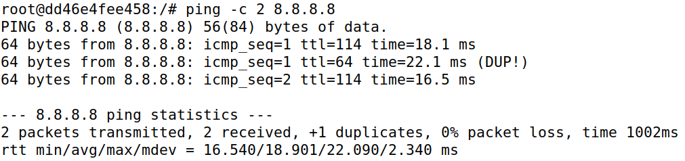

Quando testado sem o nosso programa os seguintes:

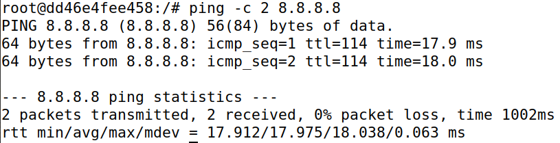


Explicações:

Primeiramente é importante perceber que quando uma máquina tenta enviar pacotes para outra, primeiro tem de ver o mac de destino, se não o conseguir o procedimento é enviar um broadcast,enviar para todos os canais ,para que consiga descobrir qual é que é o endereço mac destino.

Ao fazermos o comando ip route get, como esperado o resultado é o mesmo do primeiro teste, os pacotes passam pela máquina do atacante.

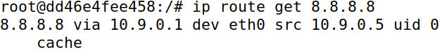

Seguidamente vimos a caputra do wireshark que comprova que foi enviado um broadcast para obter o mac da máquina seed-attacker, ou seja seriamos capazes de falsificar os pacotes. Como o destino existe mesmo, com o nosso programa o número de respostas aumenta como pode ser visto nos logs do wireshark, e que já era esperado pois é indicado aquando do comando ping "+1 duplicates". Portanto o programa funciona mas o host verdadeiro continua a responder ao ping do host A na mesma.

Com o programa:

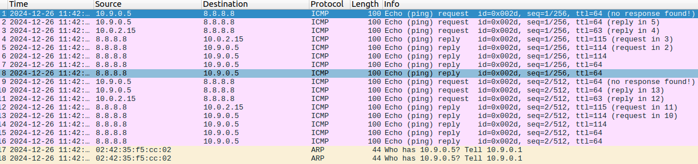

Sem o programa:

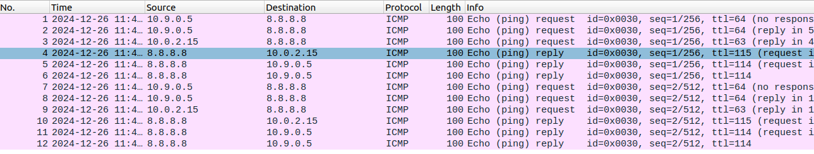


