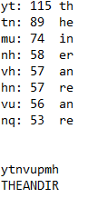
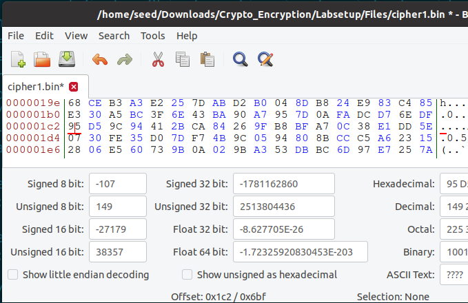
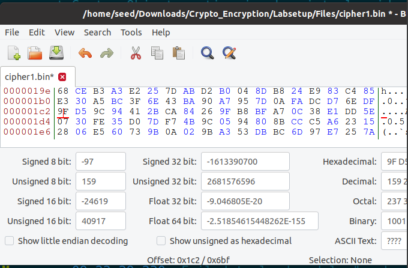
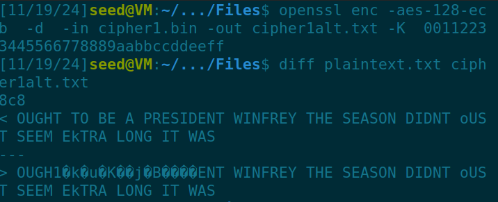
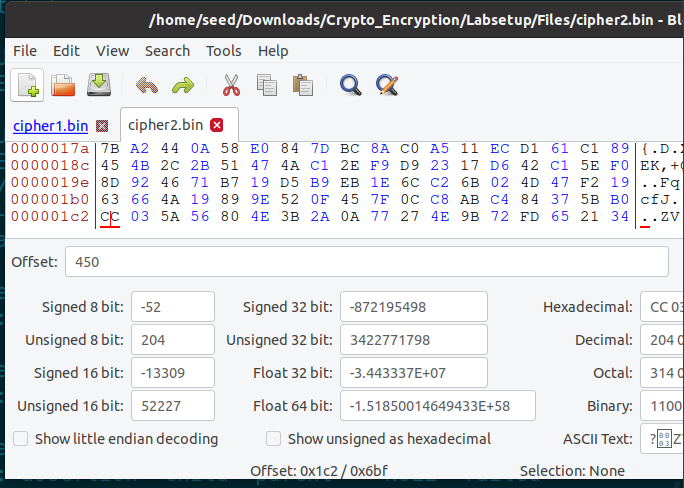
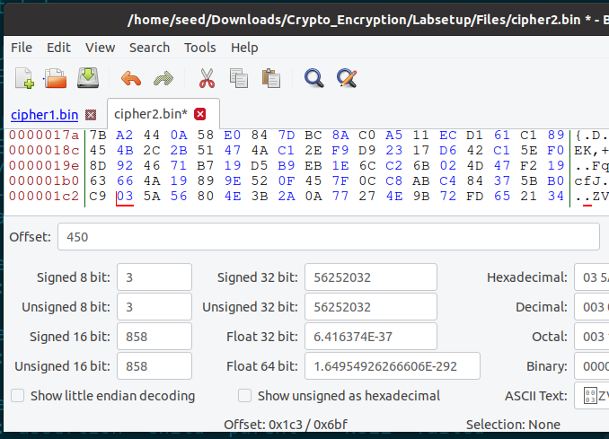
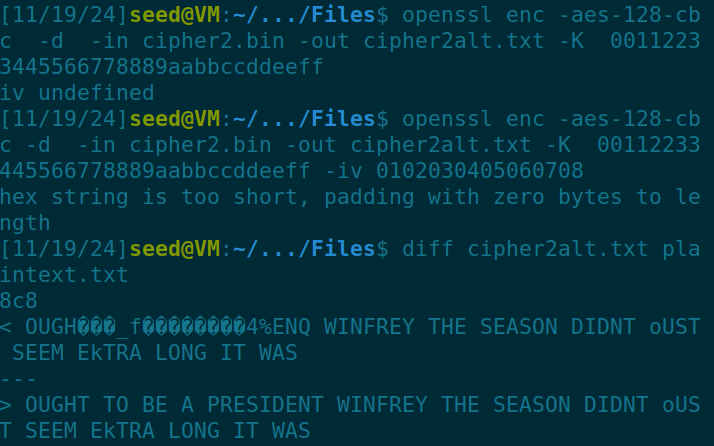
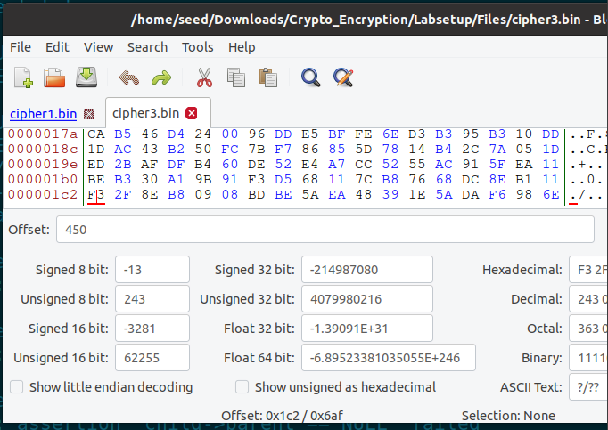
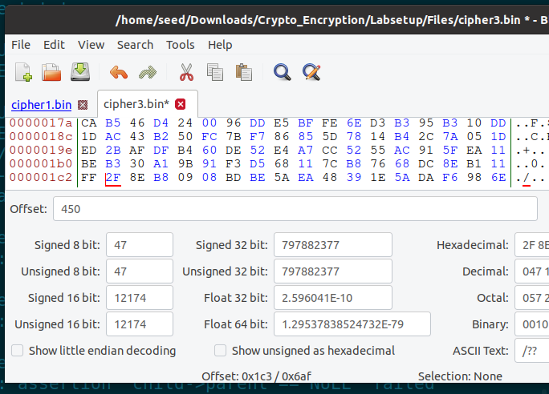
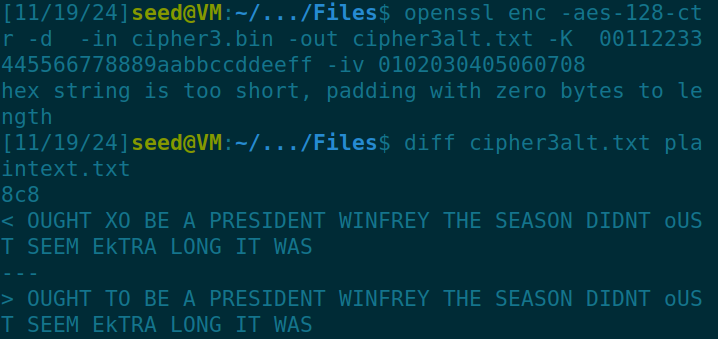

# Logbook 9

## Task 1


- Para começara esta tarefa primeiro corremos o script python para gerar os mais frequentes, e usámos os sites recomendados pelo guião para comparar "Bigram's" e "Trigram's", mas depois de 8 comparações nos bigrams não deu para ter mais comparações certas.





- Depois de termos as primeiras letras desencriptadas, descobrimos o resto das letras lendo as frases e subsituindo por letras que fizessem sentido na formação de frases e parágrafos.


**Substituição obtida:**

```shell
tr 'ytnvupmhxzgrbcaqldisfejkow' 'THEANDIROUBGFMCSWYLKVPQXJZ' < ciphertext.txt > out.txt

```


**Texto obtido com a substituição:**
```
THE OSCARS TURN  ON SUNDAY WHICH SEEMS ABOUT RIGHT AFTER THIS LONG STRANGE
AWARDS TRIP THE BAGGER FEELS LIKE A NONAGENARIAN TOO

THE AWARDS RACE WAS BOOKENDED BY THE DEMISE OF HARVEY WEINSTEIN AT ITS OUTSET
AND THE APPARENT IMPLOSION OF HIS FILM COMPANY AT THE END AND IT WAS SHAPED BY
THE EMERGENCE OF METOO TIMES UP BLACKGOWN POLITICS ARMCANDY ACTIVISM AND
A NATIONAL CONVERSATION AS BRIEF AND MAD AS A FEVER DREAM ABOUT WHETHER THERE
OUGHT TO BE A PRESIDENT WINFREY THE SEASON DIDNT JUST SEEM EXTRA LONG IT WAS
EXTRA LONG BECAUSE THE OSCARS WERE MOVED TO THE FIRST WEEKEND IN MARCH TO
AVOID CONFLICTING WITH THE CLOSING CEREMONY OF THE WINTER OLYMPICS THANKS
PYEONGCHANG

ONE BIG QUESTION SURROUNDING THIS YEARS ACADEMY AWARDS IS HOW OR IF THE
CEREMONY WILL ADDRESS METOO ESPECIALLY AFTER THE GOLDEN GLOBES WHICH BECAME
A JUBILANT COMINGOUT PARTY FOR TIMES UP THE MOVEMENT SPEARHEADED BY 
POWERFUL HOLLYWOOD WOMEN WHO HELPED RAISE MILLIONS OF DOLLARS TO FIGHT SEXUAL
HARASSMENT AROUND THE COUNTRY

SIGNALING THEIR SUPPORT GOLDEN GLOBES ATTENDEES SWATHED THEMSELVES IN BLACK
SPORTED LAPEL PINS AND SOUNDED OFF ABOUT SEXIST POWER IMBALANCES FROM THE RED
CARPET AND THE STAGE ON THE AIR E WAS CALLED OUT ABOUT PAY INEQUITY AFTER
ITS FORMER ANCHOR CATT SADLER QUIT ONCE SHE LEARNED THAT SHE WAS MAKING FAR
LESS THAN A MALE COHOST AND DURING THE CEREMONY NATALIE PORTMAN TOOK A BLUNT
AND SATISFYING DIG AT THE ALLMALE ROSTER OF NOMINATED DIRECTORS HOW COULD
THAT BE TOPPED

AS IT TURNS OUT AT LEAST IN TERMS OF THE OSCARS IT PROBABLY WONT BE

WOMEN INVOLVED IN TIMES UP SAID THAT ALTHOUGH THE GLOBES SIGNIFIED THE
INITIATIVES LAUNCH THEY NEVER INTENDED IT TO BE JUST AN AWARDS SEASON
CAMPAIGN OR ONE THAT BECAME ASSOCIATED ONLY WITH REDCARPET ACTIONS INSTEAD
A SPOKESWOMAN SAID THE GROUP IS WORKING BEHIND CLOSED DOORS AND HAS SINCE
AMASSED  MILLION FOR ITS LEGAL DEFENSE FUND WHICH AFTER THE GLOBES WAS
FLOODED WITH THOUSANDS OF DONATIONS OF  OR LESS FROM PEOPLE IN SOME 
COUNTRIES

NO CALL TO WEAR BLACK GOWNS WENT OUT IN ADVANCE OF THE OSCARS THOUGH THE
MOVEMENT WILL ALMOST CERTAINLY BE REFERENCED BEFORE AND DURING THE CEREMONY 
ESPECIALLY SINCE VOCAL METOO SUPPORTERS LIKE ASHLEY JUDD LAURA DERN AND
NICOLE KIDMAN ARE SCHEDULED PRESENTERS

ANOTHER FEATURE OF THIS SEASON NO ONE REALLY KNOWS WHO IS GOING TO WIN BEST
PICTURE ARGUABLY THIS HAPPENS A LOT OF THE TIME INARGUABLY THE NAILBITER
NARRATIVE ONLY SERVES THE AWARDS HYPE MACHINE BUT OFTEN THE PEOPLE FORECASTING
THE RACE SOCALLED OSCAROLOGISTS CAN MAKE ONLY EDUCATED GUESSES

THE WAY THE ACADEMY TABULATES THE BIG WINNER DOESNT HELP IN EVERY OTHER
CATEGORY THE NOMINEE WITH THE MOST VOTES WINS BUT IN THE BEST PICTURE
CATEGORY VOTERS ARE ASKED TO LIST THEIR TOP MOVIES IN PREFERENTIAL ORDER IF A
MOVIE GETS MORE THAN  PERCENT OF THE FIRSTPLACE VOTES IT WINS WHEN NO
MOVIE MANAGES THAT THE ONE WITH THE FEWEST FIRSTPLACE VOTES IS ELIMINATED AND
ITS VOTES ARE REDISTRIBUTED TO THE MOVIES THAT GARNERED THE ELIMINATED BALLOTS
SECONDPLACE VOTES AND THIS CONTINUES UNTIL A WINNER EMERGES

IT IS ALL TERRIBLY CONFUSING BUT APPARENTLY THE CONSENSUS FAVORITE COMES OUT
AHEAD IN THE END THIS MEANS THAT ENDOFSEASON AWARDS CHATTER INVARIABLY
INVOLVES TORTURED SPECULATION ABOUT WHICH FILM WOULD MOST LIKELY BE VOTERS
SECOND OR THIRD FAVORITE AND THEN EQUALLY TORTURED CONCLUSIONS ABOUT WHICH
FILM MIGHT PREVAIL

IN  IT WAS A TOSSUP BETWEEN BOYHOOD AND THE EVENTUAL WINNER BIRDMAN
IN  WITH LOTS OF EXPERTS BETTING ON THE REVENANT OR THE BIG SHORT THE
PRIZE WENT TO SPOTLIGHT LAST YEAR NEARLY ALL THE FORECASTERS DECLARED LA
LA LAND THE PRESUMPTIVE WINNER AND FOR TWO AND A HALF MINUTES THEY WERE
CORRECT BEFORE AN ENVELOPE SNAFU WAS REVEALED AND THE RIGHTFUL WINNER
MOONLIGHT WAS CROWNED

THIS YEAR AWARDS WATCHERS ARE UNEQUALLY DIVIDED BETWEEN THREE BILLBOARDS
OUTSIDE EBBING MISSOURI THE FAVORITE AND THE SHAPE OF WATER WHICH IS
THE BAGGERS PREDICTION WITH A FEW FORECASTING A HAIL MARY WIN FOR GET OUT

BUT ALL OF THOSE FILMS HAVE HISTORICAL OSCARVOTING PATTERNS AGAINST THEM THE
SHAPE OF WATER HAS  NOMINATIONS MORE THAN ANY OTHER FILM AND WAS ALSO
NAMED THE YEARS BEST BY THE PRODUCERS AND DIRECTORS GUILDS YET IT WAS NOT
NOMINATED FOR A SCREEN ACTORS GUILD AWARD FOR BEST ENSEMBLE AND NO FILM HAS
WON BEST PICTURE WITHOUT PREVIOUSLY LANDING AT LEAST THE ACTORS NOMINATION
SINCE BRAVEHEART IN  THIS YEAR THE BEST ENSEMBLE SAG ENDED UP GOING TO
THREE BILLBOARDS WHICH IS SIGNIFICANT BECAUSE ACTORS MAKE UP THE ACADEMYS
LARGEST BRANCH THAT FILM WHILE DIVISIVE ALSO WON THE BEST DRAMA GOLDEN GLOBE
AND THE BAFTA BUT ITS FILMMAKER MARTIN MCDONAGH WAS NOT NOMINATED FOR BEST
DIRECTOR AND APART FROM ARGO MOVIES THAT LAND BEST PICTURE WITHOUT ALSO
EARNING BEST DIRECTOR NOMINATIONS ARE FEW AND FAR BETWEEN
```


## Task 2

- Para esta tarefa usámos 3 modos: 
*aes-128-ecb
*aes-128-cbc
*aes-128-ctr


- E para encriptar e desencriptar corremos os seguintes comandos, para cada modo:

```shell
openssl enc -aes-128-ecb  -e  -in plaintext.txt -out cipher1.bin -K  00112233445566778889aabbccddeeff

openssl enc -aes-128-ecb  -d  -in cipher1.bin -out cipher1.txt -K  00112233445566778889aabbccddeeff
```

```shell
openssl enc -aes-128-cbc -e  -in plaintext.txt -out cipher2.bin -K  00112233445566778889aabbccddeeff -iv 0102030405060708

openssl enc -aes-128-cbc -d  -in cipher2.bin -out cipher2.txt -K  00112233445566778889aabbccddeeff -iv 0102030405060708
```

```shell
openssl enc -aes-128-ctr  -e  -in plaintext.txt -out cipher3.bin -K  00112233445566778889aabbccddeeff -iv 0102030405060708

openssl enc -aes-128-ctr  -d  -in cipher3.bin -out cipher3.txt -K  00112233445566778889aabbccddeeff -iv 0102030405060708
```

**Questões**

- Ao cifrar, que flags teve que especificar? Qual a diferença entre estes diversos modos?

**Flags:**

**ECB**

    -aes-128-ecb algoritmo AES no modo ECB.
    -in: Especifica o ficheiro de entrada.
    -out: Especifica o ficheiro de saída.  
    -e modo para encriptar
    -K (chave hexadecimal)


**CBC**   

    -aes-128-ecb algoritmo AES no modo CBC.
    -in: Especifica o ficheiro de entrada.
    -out: Especifica o ficheiro de saída.   
    -e modo para encriptar
    -K (chave hexadecimal)
    -iv (vetor de inicialização)

**CTR**

    -aes-128-ecb algoritmo AES no modo CTR.
    -in: Especifica o ficheiro de entrada.
    -out: Especifica o ficheiro de saída.   
    -e modo para encriptar
    -K (chave hexadecimal)
    -iv (vetor de inicialização)


**Diferenças entre modos:**

**ECB**

Encriptação de cada bloco de forma independente, dados iguais em diferentes blocos, podem surgir com o mesmo ciphertext, comprometendo a segurança.

**CBC**

Encriptação sempre com base no bloco anterior, dados iguais em diferentes blocos não podem gerar o mesmo ciphertext, a única desvantagem é precisar do iv para encriptar.

**CTR**

Encriptação que usa o iv como contador, permite encriptar blocos independentes em paralelo.
 

- Ao decifrar, que flags teve que especificar? Qual a diferença principal entre aes-128-ctr e os restantes modos?

**Flags:**

As flags usadas foram as mesma que na encriptação.

**Diferença entre aes-128-ctr e os restantes modos:**

Como já explicado em cima, a princripal vantagem do modo ctr é que permite, neste caso, decifrar paralelamente (independente) os blocos, enquanto que os outros modos processam de forma sequencial os blocos.


## Task 5


- Para cada modo, realizámos os seguintes passos:
1) abrir o editor **bless**
2) No byte 450 (50*G=9), alterar esse byte
3) Desencriptar e ver as diferenças entre o ficheiro que foi encriptado e o ficheiro desencriptado depois de alterar o byte.

**ECB**







**CBC**







**CTR**








**Conslusões depois da desencriptação com cada modo**


**ECB**

**Bytes perdidos:** 16

**Verificação de informação perdida:** A informação perdida acontece no bloco inteiro a que o byte que alterámos pertence, isto acontece porque o modo ECB decifra bloco por bloco.

**CBC**

**Bytes perdidos:** até 32, mas no nosso programa em princípio foram 17

**Verificação de informação perdida:** A informação perdida acontece no bloco do byte alterado e no bloco seguinte, acontece porque o modo CBC decifra o bloco com base no bloco anterior.

**CTR**

**Bytes perdidos:** 1

**Verificação de informação perdida:** A informação perdida acontece apenas no byte alterado.

**Conclusões sobre desencriptação:** O modo CTR é o melhor modo para desencriptar uma informação, especialmente se algo for corrompido, porque é alterada apenas a informação daquele byte. Como se pode ver na última imagem de cada modo, a informação nos modos ECB E CBC é demasiado corrompida, o que torna a informação ilegível quando desencriptada, o contrário para o modo CTR que apesar de ser corrompida continua a ser uma informação bsatante fácil de ler.